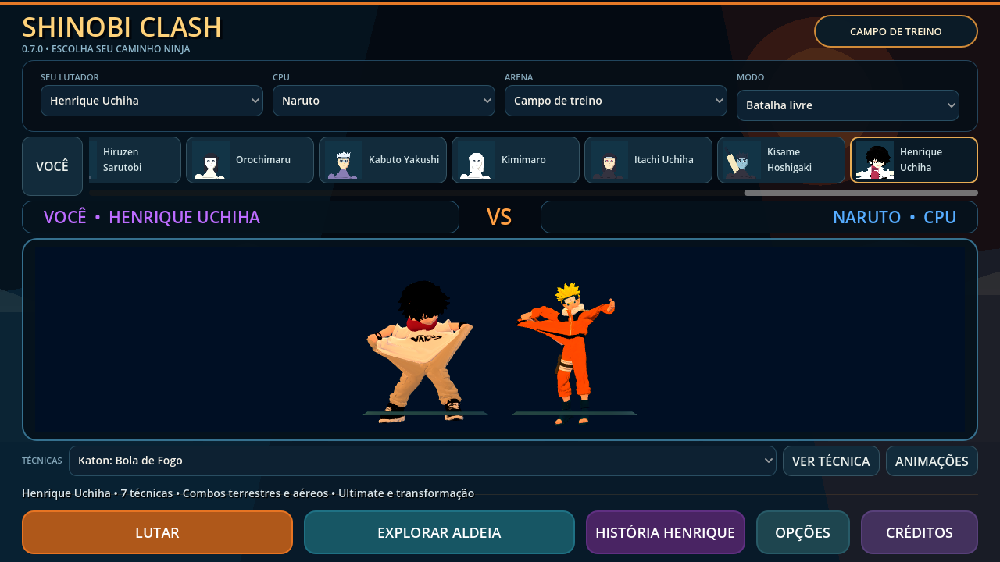
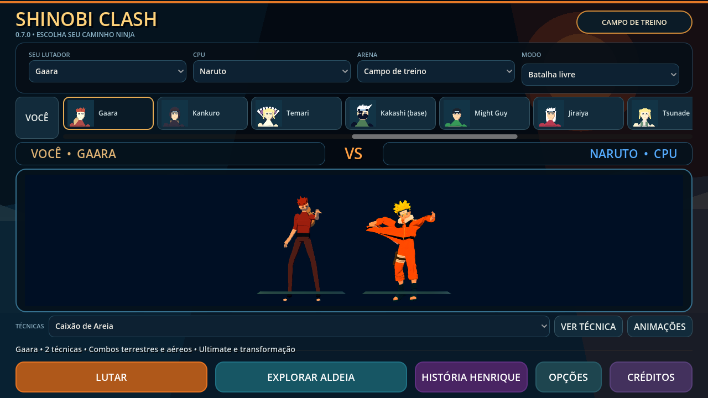
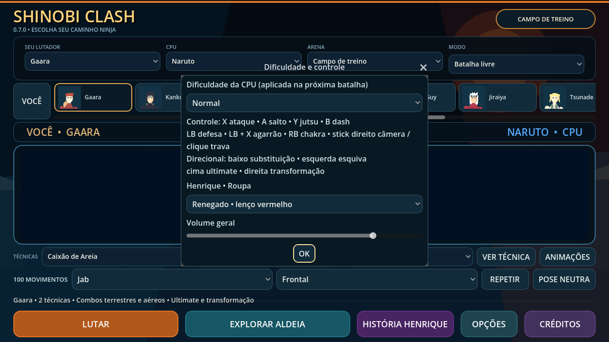

# Apresentação — 0.7.0

Consulta em 8 de outubro de 2026:

- [TV Tokyo — personagens do anime Naruto](https://www.tv-tokyo.co.jp/contents/naruto/chara.html): referência de cores, roupas e silhuetas. Naruto usa laranja/preto e cabelo loiro; Sasuke usa gola alta clara, cabelo preto e cintura violeta. Os modelos existentes continuam no projeto; esta consulta não significa que todos foram remodelados para corresponder ao anime.
- [Naruto Official — Chidori](https://naruto-official.com/en/news/01_1715): referência para energia concentrada na mão e investida, em vez de raios gigantes cobrindo a tela.

As imagens oficiais foram consultadas fora do checkout e não foram incorporadas ao jogo. Os 26 retratos são capturas originais dos modelos já presentes, renderizadas pelo Godot com MSAA 4x; reprodução em `tools/bake_roster_portraits.gd`. Mantêm a classificação de desenvolvimento das fontes.

## Mudanças

Seleção com retratos para jogador/CPU, rolagem até o personagem escolhido, prévia de técnicas, galeria de 100 movimentos recolhível, nomes das técnicas do elenco em português e tema compartilhado nos menus/diálogos. O layout padrão e a galeria aberta cabem em 1280×720. A prévia usa resolução integral e MSAA 4x.

Contornos extras das malhas foram removidos porque fragmentavam as bordas; texturas PBR e materiais com iluminação permanecem. Os cinco GLBs anteriores e os 21 modelos do elenco não foram alterados. Não há rig facial novo nem correção completa das roupas/proporções dos modelos antigos.

Combate, aldeia e regiões usam resolução alvo LOW/MED/HIGH de 0,75/0,90/1,00, com piso adaptativo de 0,70/0,80/0,90 no combate/aldeia. MSAA desativado/2x/4x conforme qualidade. LOW mantém sombras e partículas reduzidas. Estes limites precisam de medição em aparelhos físicos; as capturas OpenGL/Mesa não são benchmark Android.

A apresentação procedural cobre as 19 famílias usadas pelos kits: fogo, chamas negras, água, vento, eletricidade, areia, terra, óleo, sombra, mente, insetos, aço, ferro, marionete, osso, serpente, taijutsu, chakra e Susanoo. Armas usam lâminas direcionais, ossos usam ponta cônica, sombras ficam achatadas, insetos usam enxame sem esfera central, serpentes têm rastro ondulado e areia/terra têm superfície granular. Preparação e ataques de mão compartilham estes efeitos. A prévia de clones/armadilhas mostra a animação; não simula combate nem todos os objetos da técnica. Nenhum custo, dano, cooldown ou hitbox foi alterado.

## Validação

Godot 4.7.2; contrato de apresentação verifica 26 retratos, cobertura dos kits, seleção independente da CPU, layout com galeria, reset da prévia e geometrias próprias. Contratos de combate/elenco/mundo e testes Python continuam exigidos. APK debug ARM64 0.7.0, versionCode 8, Android 7+. Teste físico pendente.

Validação concluída: 35 contratos GDScript e 19 testes Python passaram; registro de assets aprovado. Os 121 checks de apresentação passaram também em OpenGL e no payload isolado do APK. Assinatura v2/v3 e alinhamento de 16 KB aprovados. SHA-256 do APK local: `7d7c06fd22ceb1d62a8553214afeb685830ff246e700cbeac9ff48853001aaa8`.
