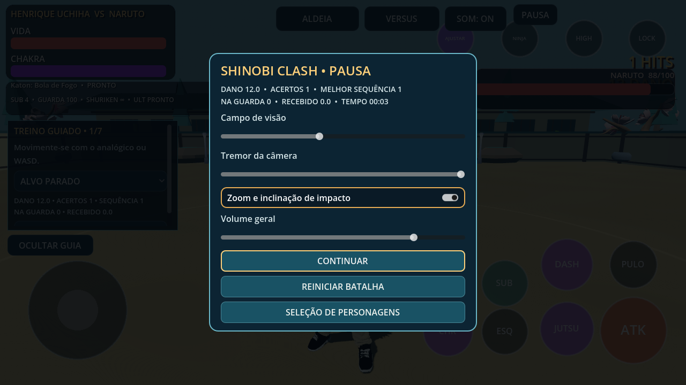
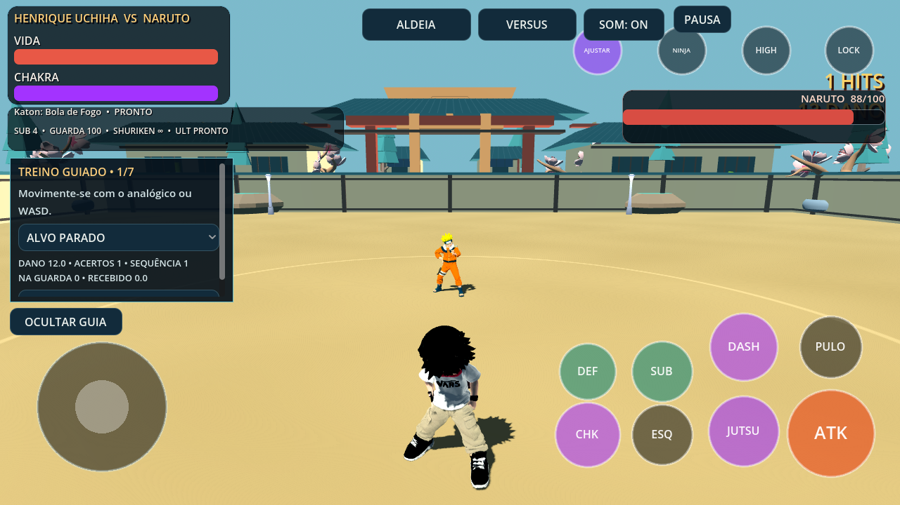

# Combate, treinamento e câmera — 0.15.0

A batalha agora possui uma pausa com retomada, reinício, seleção, volume, campo de visão, tremor e zoom/inclinação de impacto. ESC/P, LB+START, botão PAUSA e Voltar no Android abrem/fecham a pausa. START sozinho conserva a troca de líder. A pausa congela temporizadores e limpa comandos touch pendentes, sem apagar progresso ou cancelar a luta.

O alvo de treinamento mantém física, recuperação de golpes, invulnerabilidade e demais temporizadores. O guia oferece alvo parado, alvo defendendo e CPU ativa; permanece com altura limitada e rolagem acima do analógico. A análise registra dano efetivo, contatos defendidos, acertos, melhor sequência e dano recebido pelos callbacks dos líderes. A janela entre acertos é de 1,6 segundo. Estes números são da sessão, não estatísticas persistentes nem agregação de todo dano periódico, parceiros ou mobs. Zerar análise não altera vida ou campanha.

A câmera acompanha diferenças de altura e amplia o enquadramento em distâncias maiores. Campo de visão (52–72), intensidade de tremor e movimento de impacto são salvos nas preferências existentes. Arquivos antigos versão 1 recebem padrões compatíveis. Desativar movimento de impacto não desativa cinematográficas ou pausas de impacto.

Os 26 modelos existentes, rigs, biblioteca de animações, kits de jutsus, equipes, arenas, campanha e formato de progresso foram preservados.

## Evidências

- 45 contratos Godot e 21 testes Python aprovados. O contrato novo cobre 22 verificações, incluindo contato real contra guarda, pausa, retomada, modos de treino, câmera e preferências antigas.
- Contratos de exportação, modos arcade e melhorias executados também sobre os arquivos extraídos do APK, fora do checkout. Renderização OpenGL/Mesa verificada.
- APK ARM64 debug 0.15.0-battle-polish, versionCode 16, assinatura v2/v3 e alinhamento de 16 KB verificados. Certificado local preservado para atualizar a instalação anterior.
- SHA-256: `c72f5732fceae2350a941d149c826ae17ae8df05d9750d853cfc863d21e59874`.

As capturas são do Godot em Mesa, com contato controlado para demonstrar a interface. Não representam teste de desempenho Android. Validação em aparelho físico, incluindo o fechamento relatado, permanece pendente.
