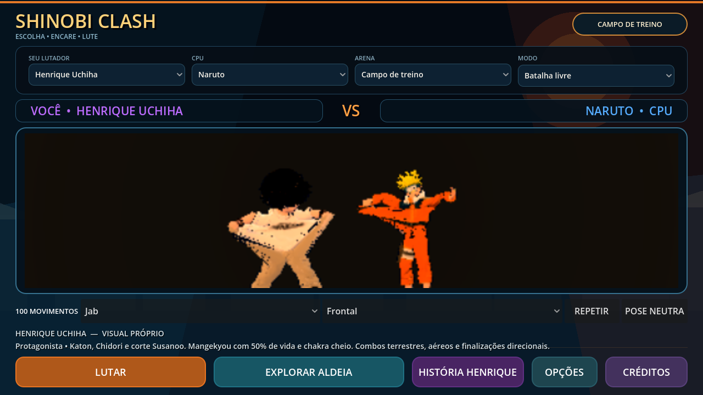

# Henrique, 100 clips de combate e APK de teste

Base: `main`, `e77963997e4f3db4a703c6d456f7b27406d1198a`. Validado com Godot `4.7.2.stable.official.ed1daf0bf`.

## Alterações

- Biblioteca com **127 clips**: 27 originais byte a byte e 100 novos clips com dados de movimento distintos. As fontes Quaternius UAL1/UAL2 CC0 e seus fingerprints permanecem iguais.
- Dez famílias: jab, direto, gancho, uppercut, corte, golpe vertical, investida, jutsu, esquiva e reação ao impacto. Cada família possui frontal, esquerda, direita, baixo, alto, espelhado, espelhado à esquerda/direita, aéreo e aéreo espelhado. São adaptações das fontes existentes, não 100 gravações inéditas de captura de movimento.
- Galeria na seleção: escolher família e variante, **REPETIR** para reiniciar e **POSE NEUTRA** para voltar. Anima somente o lutador escolhido; CPU, colisões e combate não participam da prévia.
- Henrique usa 15 desses clips: oito terrestres/aéreos, três branches, Katon, Chidori, corte Susanoo e finisher do Ultimate. As definições conservam dano, custos, hitboxes, confirmação, guarda, substituição e condições de despertar.
- Rig: 1.457 vértices à esquerda e 1.749 à direita receberam zonas suaves de ombro/cotovelo/punho. 395 vértices das extremidades dos punhos seguem rigidamente Hand. Geometria, UV, materiais, texturas, skeleton, rest e cabeça não mudaram; o GLB continua com 3.228.368 bytes e 15.398 triângulos.
- Susanoo: preparação da lâmina, golpe no tempo de impacto do clip, retorno à posição neutra, giro do corpo, inclinação/balanço durante movimento e entrada gradual. Reset/cancelamento limpa a pose. O modelo continua sem animação esquelética própria; asas continuam restritas a HIGH.
- O grafo da AnimationTree mantém transições diretas para gameplay e usa idle como conexão da galeria. No Henrique são menos de 2.500 transições, evitando montar 16.002 transições por lutador.
- Android: import ETC2/ASTC habilitado, versão de teste incrementada, configuração local reproduzível e workflow **Android test APK** (PR e execução manual) com artefato assinado.



## APK preparado

Saída local: `build/naruto-rpg-3d-henrique-debug.apk` e arquivo `.apk.sha256`. O APK é um artefato de build e não fica no Git. O workflow manual também o disponibiliza em **Actions → Android test APK → Run workflow → naruto-rpg-3d-android-test** depois que esta alteração estiver no repositório remoto.

| Propriedade | Resultado |
| --- | --- |
| Pacote | `org.shinobi.narutorpg3d` |
| Versão | `0.2.0-henrique-combat100`, código 2 |
| ABI | ARM64 (`arm64-v8a`) |
| Android mínimo | 7.0 / API 24 |
| Target SDK do template | 36 |
| Tamanho | 59.805.018 bytes. aproximadamente 57.0 MiB |
| Assinatura | Chave debug, esquemas v2 e v3 verificados |
| Alinhamento | ZIP 4 bytes e bibliotecas nativas 16 KB verificados |
| SHA-256 | `a3fd17bed5b6c9f6f806fa861833ab6081915ab7da7a3edeacfed249e7586bba` |

Instalar por USB com depuração habilitada:

```sh
adb devices
adb install -r build/naruto-rpg-3d-henrique-debug.apk
adb shell monkey -p org.shinobi.narutorpg3d 1
```

Se já houver uma instalação com outra chave, Android recusará a atualização. Faça backup do save antes de decidir desinstalar essa versão. O APK debug não contém uma chave de release.

### Roteiro no aparelho

1. Na seleção, testar as dez famílias e dez variantes, REPETIR e POSE NEUTRA; trocar personagem e confirmar a preservação do elenco.
2. Iniciar Henrique contra Naruto: combos terrestres/aéreos, branches, guarda, substituição, Katon e Chidori. Confirmar dano somente no impacto e recuperação sem volumes presos.
3. Com HP ≤50%, chakra cheio, no chão e sem outra ação, acionar o despertar pelo comando existente. Verificar entrada, corte, interrupção, expiração de 14 s e cooldown.
4. Testar Ultimate com entrada confirmada, erro, guarda e cancelamento. Alternar LOW/MEDIUM/HIGH; asas devem aparecer somente em HIGH.
5. Explorar a aldeia, iniciar missão, salvar/reabrir e testar os desbloqueios existentes. Observar toque, legibilidade, tempo de carregamento, memória e FPS durante alguns minutos.

## Reprodução

Dependências offline de animação/rig: Python com numpy, scipy e Pillow.

```sh
python3 tools/bake_combat_animations.py
git show e779639:assets/characters/henrique/henrique_mobile_rigged.glb > /tmp/henrique-v1.glb
python3 tools/refine_henrique_weights.py --input /tmp/henrique-v1.glb --output assets/characters/henrique/henrique_mobile_rigged.glb
```

O gerador original `tools/rig_henrique.py` também aplica o refinamento depois de gerar a malha com o upload privado. Perfis e registro de assets precisam refletir os fingerprints quando se alterar um gerador.

Para Android, instalar JDK 17 ou superior, Android platform-tools, `platforms;android-35`, `build-tools;35.0.0`, Godot 4.7.2 e seu `export_templates.tpz` oficial. O template não Gradle já contém as bibliotecas compiladas com SDK 36; build-tools 35 assinou e alinhou este APK com sucesso.

```sh
python3 tools/setup_android_export.py --godot /caminho/godot --sdk /caminho/android-sdk --java /caminho/jdk --templates /caminho/export_templates.tpz
/caminho/godot --headless --path . --editor --import
python3 tools/export_android.py --godot /caminho/godot --output build/naruto-rpg-3d-henrique-debug.apk
/caminho/android-sdk/build-tools/35.0.0/apksigner verify --verbose build/naruto-rpg-3d-henrique-debug.apk
/caminho/android-sdk/build-tools/35.0.0/zipalign -c -P 16 4 build/naruto-rpg-3d-henrique-debug.apk
```

`setup_android_export.py` verifica versões, instala somente os templates Android, cria uma chave debug padrão e configura EditorSettings local. Caminhos da máquina e chaves não entram no repositório.

## Validação realizada

- Importação sem SCRIPT ERROR ou ERROR no Godot 4.7.2.
- 26 contratos GDScript existentes passaram com a biblioteca expandida, incluindo deformação real de Henrique/Naruto, personagens, CPU, combo, câmera, campanha, RPG e mundo.
- Novo `combat_expansion_contract.gd`: 100 seleções reais da galeria, reinício de one-shot, independência da CPU, grafo limitado, preparação/impacto/recuperação da lâmina, summon/reset e hitboxes dos novos combos. Passou headless e OpenGL Compatibility com llvmpipe.
- 15 testes Python passaram. O novo contrato confere 100 movimentos distintos, preservação byte a byte dos 27 antigos, fontes CC0, timing, pesos, punhos, cabeça e fingerprint de todo o GLB fora dos pesos. Reaplicar o refinamento é idempotente.
- Registro de assets e `git diff --check` passaram.
- ZIP do APK íntegro; assinatura v2/v3 e alinhamento de 16 KB passaram. Contém somente bibliotecas ARM64 e inclui a atribuição do Susanoo.
- Conteúdo de `assets/` extraído do APK e executado pelo Godot Linux fora do checkout: contratos de payload confirmaram personagens, jutsus, mundo, campanha, regiões e Henrique/Susanoo. O novo contrato de galeria/combate também passou no payload.
- Pacote público rejeitado validado com `public_payload_contract.gd`, independente das classes de gameplay que o gate exclui. Confirmou ausência de autoload, cenas e modelos não liberados, incluindo Henrique e Susanoo.

Isso não comprova instalação, toque, driver gráfico ou desempenho em Android físico. As capturas usam renderização por software e não são benchmarks de celular. Save v1, os 25 personagens anteriores, atribuições e o gate de distribuição pública foram preservados.
