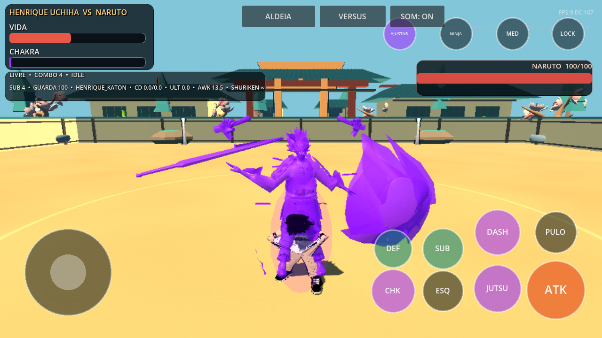
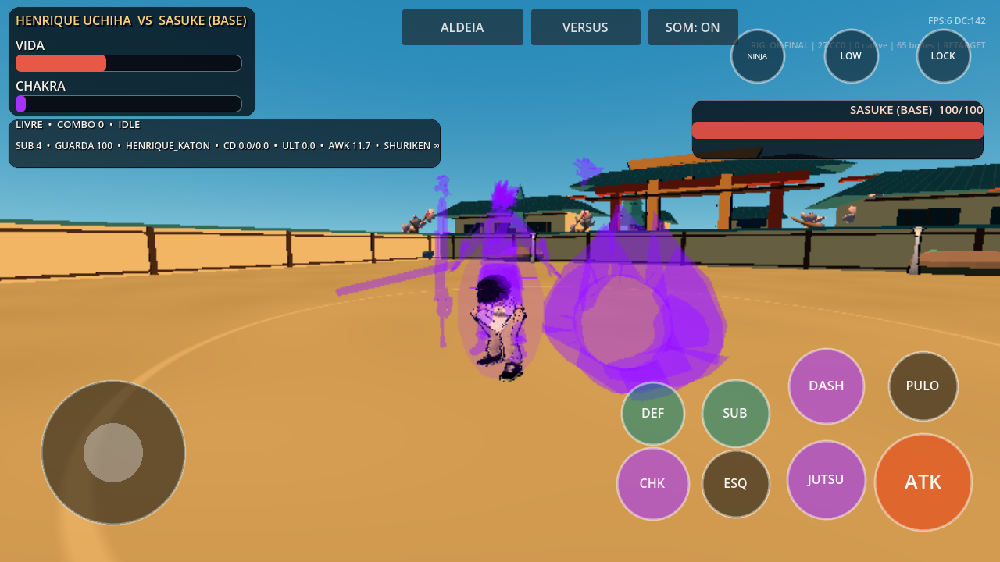

# Henrique Uchiha: integração

## Correção das malhas — 0.8.0

Henrique e Naruto agora usam derivados ligados à pose original recuperada, corrigindo as roupas esticadas já presentes no repouso da versão 0.7.0. Originais, UVs, topologia, texturas e os demais personagens foram preservados. Seleção de dificuldade, dados dos jutsus, pressão de guarda da CPU e diálogos/NPCs também foram refinados. Evidências e reprodução em [SKIN_REPAIR_080.md](SKIN_REPAIR_080.md). APK debug ARM64 versionCode 9; validação física pendente.

## Menus, nitidez e técnicas — 0.7.0

Seleção com 26 retratos, prévia das técnicas, galeria recolhível e tema comum para menus/diálogos. Resolução e antisserrilhado ajustados no combate e exploração; contornos extras que fragmentavam as malhas removidos. Apresentação procedural das 19 famílias de jutsus, sem alterar balanceamento. Modelos preservados byte a byte. Referências oficiais consultadas, mudanças, capturas e limites em [ANIME_PRESENTATION_REFERENCES.md](ANIME_PRESENTATION_REFERENCES.md). APK debug ARM64 versionCode 8; teste físico pendente.

## Jutsus elementais — 0.6.0

Chidori/Raikiri agora usam segmentos com escala no eixo local correto: raios curtos ao redor da mão, com núcleo elétrico. A escala e o relógio são reiniciados entre jutsus. Nagashi usa um pulso circular junto ao chão, com vida visual de 0,38 s independente da janela de dano; interrupções limpam imediatamente o efeito.

Projéteis de fogo, água, vento, chakra, chamas negras, mente, areia, eletricidade e Susanoo passam a usar superfície procedural animada e rastro orientado pelo movimento. A onda Katon tem silhueta larga; Amaterasu tem chamas negras animadas também no alvo. Preparação cresce na mão e desaparece ao lançar. Colisões com lutador/parede geram impacto elemental pelo pool existente. Três SFX originais foram sintetizados, mantendo oito vozes de áudio. Com alvo travado, o lançamento já aponta para ele; sem trava, mantém a direção manual. Custos, dano, cooldowns, defesa, substituição, status e personagens continuam pelos contratos existentes.

Efeitos novos usam meshes reutilizados: 6/10/16 motes por instância em LOW/MED/HIGH, sem criar nós por quadro, sem novas luzes dinâmicas. São efeitos procedurais estilizados; não há cinematográficas ou dublagem nova nesta etapa.


Capturas de apresentação feitas no Godot 4.7.2/OpenGL Compatibility/Mesa, com câmera fixa de inspeção e timeline pausada; não são benchmark de Android. APK debug ARM64 0.6.0, versionCode 7, Android 7+. Assinatura v2/v3, alinhamento de 16 KB e conteúdo extraído do APK foram verificados fora do checkout, inclusive renderização do contrato dos jutsus. Teste em aparelho físico pendente.


## Modelos do elenco — 0.5.0

Os 21 personagens que usavam o rig genérico agora têm GLBs próprios com proporções humanas estilizadas, roupa, cabelo, rosto, acessórios skinados e dedos articulados. Cada modelo possui 65 ossos e usa a biblioteca de 127 clips existente. São aproximações originais estilizadas, sem rig facial; acabamento de produção ainda pendente. Naruto, Sasuke, Sakura, Kakashi e Henrique foram preservados byte a byte; fingerprints registrados em `assets/characters/final/roster_manifest.json`. Kits, índices do elenco e sistemas existentes preservados. O fallback permanece disponível se um modelo estiver ausente ou incompatível.


APK debug ARM64 `0.5.0-roster-models`, Android 7+, validação física pendente.


## Evolução visual — Shinobi Clash 0.4.0

Continuação preservando o modelo, os 65 ossos, os pesos refinados e o elenco.
Sete arenas selecionáveis agora têm cenografia distinta: treino, pátio, distrito
Uchiha, vale, floresta, esconderijo e ruínas. As novas são interpretações
procedurais originais, com a área/colisões compartilhadas preservadas.
Susanoo tem formas parcial e esquelética procedurais e armadura/perfeito usando
o modelo articulado existente; as formas iniciais não têm skin independente.
Invocação percorre as formas; depois AWK/tecla 6/direcional direito alterna.
Há multiplicadores próprios de dano/movimento, mantendo duração e cooldown.
OPÇÕES oferece roupa original, lenço vermelho ou colete, presos aos ossos;
não são roupas inteiramente remodeladas e skinadas. Rig facial continua pendente.

Henrique possui sete jutsus: os três anteriores, Nagashi de área, Amaterasu com
status limitado de chamas/dano periódico, Genjutsu com hitstun e distorção da
visão do jogador atingido, e onda Katon ampla sem perseguição. Custos/cooldowns,
defesa, substituição, interrupções e desbloqueios usam os contratos existentes.
Três loops instrumentais originais foram sintetizados para exploração/luta/chefes.
Não há dublagem nova. Detalhes e critérios restantes em
[SHINOBI_CLASH_EVOLUTION.md](SHINOBI_CLASH_EVOLUTION.md).

## Histórico — Shinobi Clash 0.3.0

Susanoo agora usa o derivado `susanoo_mobile_rigged.glb`: **25 ossos**, skin e cinco animações próprias. A espada do modelo acompanha a mão; materiais passam a receber iluminação. Esta etapa também acrescenta defesa precisa/contra-ataque, arremesso, dificuldades, controle Bluetooth por InputMap, layout touch editável, quatro modos adicionais e uma campanha Henrique de seis capítulos com escolha salva. O APK continua debug ARM64; validação física permanece pendente. Escopo entregue e plano completo em [SHINOBI_CLASH_EVOLUTION.md](SHINOBI_CLASH_EVOLUTION.md).

As seções abaixo preservam o histórico da integração e da primeira expansão.

## Continuação a partir de e779639 — combate e Android

O estado abaixo documenta a entrega original. A continuação preserva os 26 personagens, a campanha e os sistemas existentes e acrescenta **100 clips de combate**, mantendo os 27 originais byte a byte. São dez famílias com dez adaptações espaciais das fontes CC0 já registradas; não são 100 novas gravações de mocap. A seleção permite visualizar todos, e Henrique usa novos clips nos combos, branches, Katon, Chidori, corte e Ultimate.

O rig mantém malha, texturas, rest, 65 ossos e cabeça rígida; somente os pesos de 3.206 vértices dos ombros/mangas/punhos foram refinados. Susanoo ganha antecipação, impacto sincronizado ao manifesto, recuperação, inclinação de movimento, entrada gradual e reset. Naquela expansão, o modelo externo ainda não tinha skeleton próprio; a etapa 0.3.0 acima resolve isso.

Foi gerado e validado um **APK debug ARM64**, versão `0.2.0-henrique-combat100`, Android 7.0 ou superior. Assinatura v2/v3, alinhamento de 16 KB e conteúdo extraído do APK passaram; teste em aparelho físico continua pendente. Procedimentos, evidências e limitações em [COMBAT100_ANDROID.md](COMBAT100_ANDROID.md).



## Estado entregue

- Protagonista inicial e da campanha: Henrique Uchiha. Seleção tem 26 personagens; os 25 anteriores continuam nos mesmos índices e com os mesmos modelos/kits.
- Fonte do Henrique: `3970037e-fd4c-4114-b9f6-75905e547ff4.zip`, PBR GLB sem skeleton, skin ou animações. A integração usa realmente essa malha, não o ninja genérico.
- Saída: `assets/characters/henrique/henrique_mobile_rigged.glb`, 3.228.368 bytes, 21.707 vértices, 15.398 triângulos, 65 ossos e quatro influências normalizadas por vértice. Texturas de até 1024 px.
- Cabeça chibi rígida e landmarks específicos do upload, ajuste offline para T-pose. `RiggedCharacterAdapter` retargeta as 27 animações existentes para as proporções do novo skeleton; player, CPU, menu e exploração compartilham clips preparados, com playback independente.
- Combos terrestres, aéreos e branches próprios; Katon, Chidori, despertar Susanoo, corte de área e Ultimate de entrada confirmada. Todos usam os hitboxes, guarda, substituição, interrupção, pools e câmera existentes.
- Despertar: HP ≤50%, chakra cheio, no chão e sem outra ação; consome chakra, transforma em 0,85 s, dura 14 s, movimento ×1,08 e dano ×1,30. Interrupção durante transformação, KO, reset ou expiração removem o avatar; cooldown 18 s. A câmera recua 1,2 m apenas enquanto Henrique transforma/está transformado.
- Corte exige despertar ativo; a área só abre no momento de impacto da animação e um alvo não recebe dano repetido do mesmo hitbox. Ultimate custa 80 chakra e não pode começar durante despertar; mantém os contratos de entrada, guarda, miss, lock e cancelamento do controlador existente.
- Save versão 1 preservado. Na campanha, os marcos `demon`, `clones`, `barrage` correspondem a Katon, Chidori e corte Susanoo; versus/treino mantêm o kit completo. Diálogo do protagonista usa Henrique; missões, adversários, recompensas, inventário, skills e mapa não foram substituídos.

## Susanoo pronto

Modelo escolhido: [Perfect susanoo](https://sketchfab.com/3d-models/perfect-susanoo-c1ef38744eb64891b26a6f41aac1b199), por [wahidinesport](https://sketchfab.com/wahidinesport), anunciado sob [CC BY 4.0](https://creativecommons.org/licenses/by/4.0/).

O arquivo de preservação contém glTF, binário, texturas e `license.txt`. O título, autor e licença foram conferidos também nos metadados públicos da API do Sketchfab. O arquivo original tem 34.098 triângulos e **não contém skin ou animações**. A saída GLB tem 11.961 triângulos e 564.144 bytes. O jogo aplica material de chakra violeta e anima uma lâmina própria; a armadura estática acompanha o protagonista e pulsa. As asas largas aparecem somente em HIGH para preservar a leitura do combate em celular.

A atribuição original está em `assets/susanoo/LICENSE.txt`, `THIRD_PARTY_NOTICES.md`, e no botão CRÉDITOS da seleção. O arquivo de licença está incluído no export Android. `source_manifest.json` registra a origem e os fingerprints.

O registro conserva DEVELOPMENT_ONLY e o gate público existente: a licença declarada pelo uploader não comprova os direitos de apresentação da franquia, e a licença de geração do modelo fornecido pelo jogador não foi enviada. Nenhuma liberação pública adicional foi presumida.

## Reprodução

A fonte original do Henrique fica fora do Git. Recriar com numpy, scipy, Pillow e gltfpack **1.3**:

```sh
python3 tools/rig_henrique.py --source /caminho/base_basic_pbr.glb --gltfpack /caminho/gltfpack
```

O script confere o SHA-256 do upload antes de gerar a malha. O skeleton de referência e a biblioteca são os já presentes no projeto. Fingerprints da fonte e saída ficam em `rig_profile.json` e `asset_registry.json`.

Converter o download glTF do Susanoo com gltfpack 1.3:

```sh
gltfpack -i /caminho/scene.gltf -o assets/susanoo/susanoo_mobile.glb -si 0.30 -se 0.004 -sp -sv -noq -kn -ke
```

## Validação

Godot **4.7.2.stable.official.ed1daf0bf**, Linux:

- Importação sem SCRIPT ERROR ou ERROR.
- **26 contratos GDScript passaram**, incluindo o novo `henrique_contract.gd`, regressões de Naruto, elenco, CPU, combos, câmera, campanha e exploração.
- O contrato Henrique testa a skin real em três fases de cada uma das 27 animações, pesos, bounds, movimento efetivo, dois skeletons independentes, modelo Susanoo externo, qualidade, transformação, dano, expiração, interrupção, jutsus, Ultimate e campanha.
- **13 testes Python passaram**, incluindo o gate de assets e ferramentas de pesquisa existentes.
- Registro de assets e `git diff --check` passaram.
- Export **Android PCK** carregado isoladamente fora do checkout: elenco, mundo, regiões e Henrique/Susanoo/atribuição passaram. Isso verifica o conteúdo do pacote, **não equivale a testar um APK em um aparelho Android**.
- Captura OpenGL Compatibility com llvmpipe: modelo enviado e armadura pronta aparecem juntos. FPS da captura em software não é um benchmark de celular.
- Novo contrato adicionado ao workflow existente, fixado no Godot 4.7.2.



Limitações: rig é um ajuste inicial específico da malha, ainda refinável em ombros/mangas/mãos. Susanoo não tem animação esquelética própria; aura e lâmina são animadas pelo jogo. APK, instalação, toque e desempenho em aparelho Android físico não foram verificados neste ambiente.

## Continuação 0.4.1 — resposta e treino

O comando de próximo golpe passa a ser aceito também durante startup, com uma
única ação em fila. Direção fica congelada no instante do toque; interrupções
limpam a fila. Henrique usa variantes esquerda/direita/alta/baixa nos três
primeiros golpes e espelhada aérea à esquerda. Finalizadores, custos e dano-base
permanecem. Recursos do moveset são duplicados ao selecionar uma variante,
e o hitbox lê o mesmo clip/manifesto até o impacto. A biblioteca mantém 127 clips.

O grafo mobile conecta variantes de combate e hubs de movimento/interrupção
sem voltar a criar uma matriz de 127² transições. Nagashi usa os forks elétricos
prealocados; armadura/perfeito interpolam escala; touch mostra FORMA durante
Susanoo ativo. Treinamento ganha sete objetivos não bloqueantes, guia ocultável
com reinício e preparação explícita de despertar apenas nesse modo. Não há
persistência de conquistas/tutorial nesta etapa. Face/dublagem permanecem pendentes.

O CI 0.4.0 falhava ao buscar `CONTRACT: PASS` no contrato visual, cuja mensagem
não continha `CONTRACT`. Os marcadores visual/input foram uniformizados; a
verificação de erros permanece ativa. Evidências: SHINOBI_041_VALIDATION.md.
