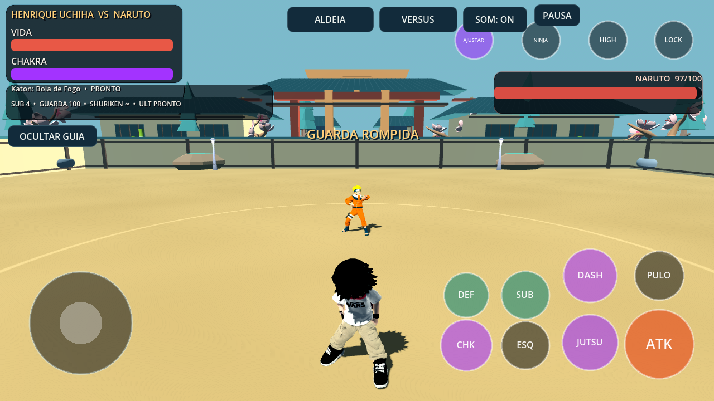
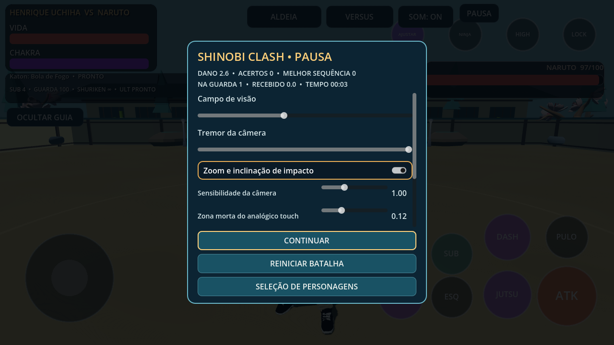
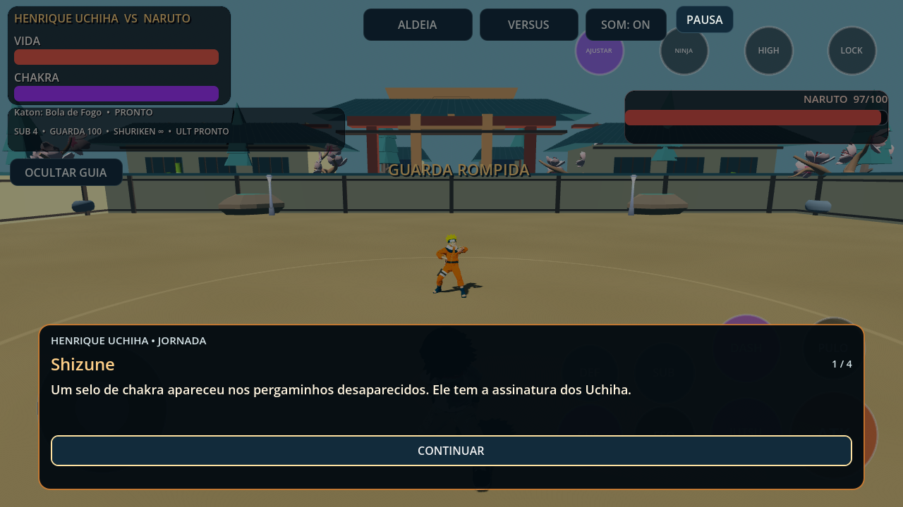

# Atualização integrada — 0.16.0

A atualização conecta resposta de movimento, decisões defensivas, apresentação de impactos, áudio, controles e diálogos. Continua main e779639 e as etapas anteriores; não substitui o jogo nem seus personagens.

## Mudanças jogáveis

- Salto aceita comando até 120 ms antes de aterrissar e até 80 ms depois de sair de uma borda. Dano, derrota, cinematográfica, respawn e pausa limpam intenções pendentes. Regras de ações continuam impedindo salto durante ataques, jutsus e esquivas.
- Dash após acerto confirmado aceita comando até 160 ms antes da janela de cancelamento. Usa os tempos do manifesto, mantém limite de combo/chakra/dashes aéreos e consome chakra uma vez. Errar o golpe não libera cancelamento confirmado.
- CPU observa golpes próximos, espera seu atraso de reação e pode defender/esquivar enquanto neutra. Memória curta de pressão é limitada a três observações e decai; não lê comandos futuros nem altera vida/dano. Dificuldade Treino e alvos passivos não recebem essa reação.
- Hitboxes preservam a defesa anterior ao contato, inclusive quando o próprio contato rompe a guarda. Combo, Storm e análise deixam de tratar esse contato defendido como acerto livre. Fontes com o callback antigo seguem compatíveis.
- HUD destaca arremesso, contra-ataque e quebra de guarda. Segmentos dourados mostram a vida recentemente perdida e desaparecem com atraso limitado.
- Brasas sobem, gotas seguem arcos, terra/ossos caem e fragmentos de vento/Susanoo acompanham a direção do impacto. Mesmos pools, limites por qualidade e ausência de novas luzes/colisores. Apresentação não cria dano adicional.
- Susanoo amostra a passada pela distância percorrida, reduzindo deslizamento visual com velocidades diferentes. Ossos, modelos e tempos de ataque preservados.
- Oito vozes SFX agora são posicionais; impactos e passos usam a origem real. Contatos elementais escolhem sons adequados do banco existente, com pequena variação de pitch e limitação de repetição. Música e SFX têm volumes próprios além do volume geral.
- Zona morta touch e sensibilidade de câmera são configuráveis; resposta radial contínua é compartilhada por combate/exploração. Pausa usa rolagem nos ajustes para manter as ações visíveis. Novas preferências são opcionais em arquivos versão 1.
- Diálogos revelam texto gradualmente: primeiro toque mostra a linha inteira, segundo avança. Escolhas não podem ser puladas e respostas/saves continuam pelo sistema existente. Nome do NPC/ponto mais próximo recebe destaque.
- Efeitos de CombatFeedback mantêm seus relógios congelados durante pausa; recuperação de time_scale após hit-stop continua monitorada.

## Os 20 pontos solicitados

| Área | Entrega nesta versão e estado restante |
| --- | --- |
| Combate | Cancelamento em fila, classificação de guarda, feedback; combos, agarrões, aéreo e hitboxes existentes verificados. |
| Movimentação | Buffer de salto, tolerância de borda e analógico contínuo; corrida/dash/esquivas preservados. |
| Animações | Passada do Susanoo acompanha distância; biblioteca e transições existentes validadas. Expressões faciais novas pendentes. |
| IA | Reação próxima atrasada, memória curta e diferenças por dificuldade; arsenal e perseguição preservados. |
| Personagens 3D | 26 modelos/rigs preservados e testados. Não houve remodelagem ou rig facial novo. |
| Jutsus | Trajetórias de impacto e áudio por elemento refinados. Kits, alcance, dano, recarga e colisões preservados. |
| Susanoo | Passada refinada e sistemas existentes validados; armadura, espada, formas e rig conservados. |
| Gráficos | Leitura de dano e impactos refinada; perfis gráficos existentes preservados. Sem reflexos/pós-processamento novo. |
| Câmera | Sensibilidade e preferências aplicadas também na exploração; enquadramento e sequências existentes preservados. |
| Efeitos visuais | Fragmentos por família elemental, pausas estáveis e pools limitados. |
| Cenários | Interação próxima destacada; sete arenas, objetos e mundo existentes verificados. Sem arena nova. |
| Interface | Eventos de combate, indicação de vida perdida e ajustes com rolagem. |
| Android/controle | Sensibilidade, zona morta, buffers e limpeza de intenções na pausa; layout e Bluetooth preservados. |
| Áudio | Posicionamento, mixagem separada, pitch e sons elementais. Sem dublagem ou trilha nova. |
| História | Apresentação gradual e escolhas protegidas; seis capítulos Henrique preservados. Sem capítulo novo. |
| Modos | Treino, versus, torneio, sobrevivência, chefes, mobs e exploração validados. Multiplayer continua futuro. |
| Progressão | Saves, escolhas, skills, recompensas e desbloqueios existentes validados. Sem conquistas/trajes novos. |
| Qualidade técnica | Regressões, payload isolado, pausas e pools verificados; desempenho/crash físico Android pendentes. |
| Apresentação | HUD, diálogos, configurações e capturas reais refinados. |
| Publicação | APK de teste, capturas, prévia em vídeo e [rascunho itch.io](ITCH_IO_DRAFT_0160.md). Publicação externa não executada. |

## Evidências

46 contratos Godot e 21 testes Python aprovados; contrato integrado com 30 verificações headless e 32 em OpenGL, incluindo contato real que rompe guarda. OpenGL Compatibility/Mesa e contratos extraídos do APK executados fora do checkout. Registro de assets aprovado; modelos/animações existentes conservados.

APK ARM64 debug `0.16.0-integrated-polish`, versionCode 17, Android 7+. Assinatura v2/v3 e alinhamento de 16 KB verificados. Certificado local preservado, permitindo atualizar a instalação anterior sem desinstalar.

SHA-256: `2de97873f9dc34f79c99c33308a379a8c1810fd3e0a8d35d5e8e9965cf0320e8`.

Capturas Godot/Mesa com timeline controlada para inspeção; não são benchmark de celular. A prévia em vídeo é uma montagem dessas capturas com música original existente, identificada como prévia de desenvolvimento; não simula gameplay contínuo. Arquivos instaláveis e vídeo são entregues em shared/downloads, fora do Git.

A exportação pública continua sujeita ao gate existente em `addons/release_asset_gate/export_gate.gd`: assets DEVELOPMENT_ONLY e autorização de distribuição ainda não registrada. O APK é para teste privado. A atualização não remove essa restrição nem presume licenças novas. O fechamento relatado no aparelho ainda depende de reprodução/logcat.
