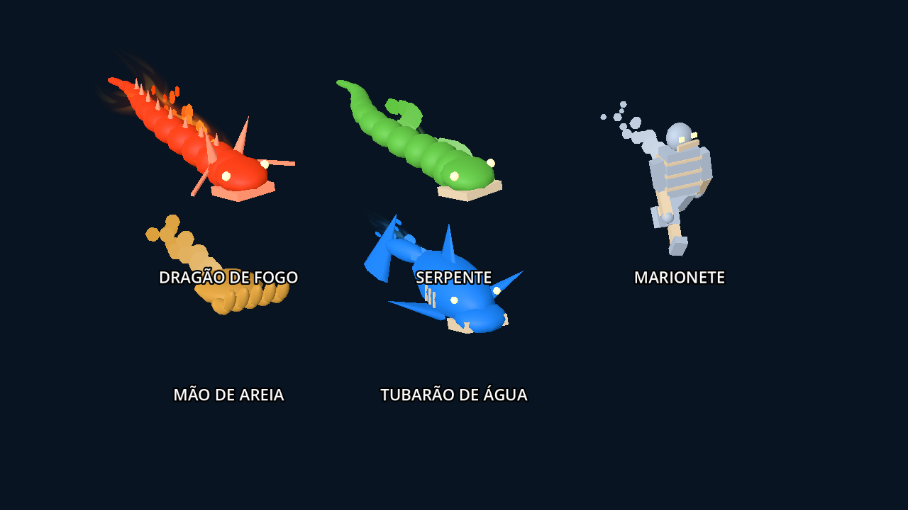
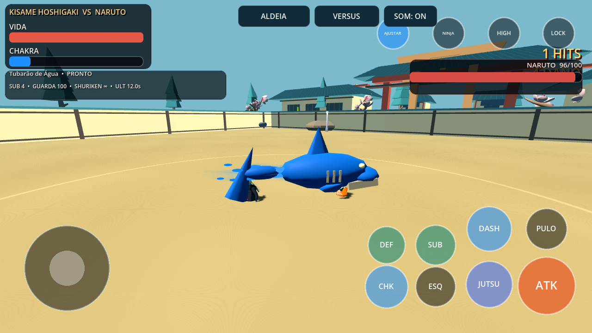

# Técnicas articuladas e direção de supremos — 0.13.0

Continuação de 694fc03, na branch de integração criada a partir de main/e779639. `HENRIQUE_INTEGRATION.md` foi lido antes das alterações.

## Mudanças integradas

- Dragões de fogo e terra: corpo com 12 segmentos articulados, mandíbula, dentes, olhos, chifres, crista e bigodes; 13 ossos. Ondulação de coluna e abertura de mandíbula.
- Serpentes de Orochimaru: 13 ossos, corpo, cabeça, olhos, presas e mandíbula móvel; ondulação própria.
- Marionetes de Kankuro: 10 ossos, torso segmentado, cabeça, braços, antebraços, pernas e canelas; membros articulados durante o ataque.
- Areia de Gaara: palma e cinco dedos com duas articulações; 11 ossos, fechamento animado.
- Tubarão de Kisame: corpo, mandíbula e cauda articulados, barbatanas, dentes, olhos e guelras; três ossos.
- Os modelos entram pelos IDs/elementos dos jutsus existentes, incluindo a prévia do menu, ataques de mão, projéteis e áreas. Fogo comum continua usando seu efeito de volume.
- Supremos do controlador do elenco, incluindo Henrique, recebem apresentação elemental com preparação, aproximação/varredura e conclusão. Três enquadramentos substituem a esfera genérica entre entrada e finalizador. Henrique conserva seu Susanoo; Naruto conserva seu QTE e sequência de clones.
- A apresentação só começa após entrada confirmada. Seus modelos não possuem colisão nem aplicam dano. O finalizador continua usando o hitbox e os valores existentes; cancelamento remove modelos e libera câmera/alvo.

Os modelos são originais, procedurais e estilizados: peças rígidas seguem `Skeleton3D` por `BoneAttachment3D`. Não são malhas orgânicas skinadas nem modelos de produção do Storm 4. As cinco silhuetas usam geometria própria; o dragão de terra reaproveita a estrutura do dragão de fogo com o material elemental correspondente.

## Recursos e preservação

Uma estrutura reutilizável por instância de apresentação. O esqueleto só é reconstruído quando a família de modelo muda; nenhum nó, mesh ou material é criado durante a animação por quadro. LOW oculta cristas secundárias de dragões. Instâncias possuem skeleton e relógio próprios e reiniciam poses ao configurar novamente.

Os 26 modelos de lutadores, biblioteca de 127 clips (incluindo as 100 adaptações anteriores), kits, custos, dano, cooldowns, defesa, substituições, equipes, campanha e formato de save permanecem. Nenhum arquivo de modelo do elenco foi modificado. Não foram acrescentados rig facial, dublagem ou multiplayer online. Supremos permanecem sequências curtas próprias; não são as coreografias completas do jogo comercial.

## Evidências

Capturas no Godot 4.7.2, OpenGL Compatibility/Mesa, com timeline controlada e câmera de inspeção. Não são benchmark de Android nem captura em aparelho físico.

- Novo `jutsu_construct_contract.gd`: 79 verificações de esqueletos, animação efetiva, independência entre instâncias, três qualidades, orçamento de nós, orientação, reutilização, entrada real, ausência de dano pelo efeito e limpeza de câmera/alvo.
- Contrato novo e apresentação anterior (203 verificações) passaram também em OpenGL usando somente os assets extraídos do APK, fora do checkout.
- Payload Android preserva elenco, mundo, regiões, Henrique/Susanoo e os novos scripts.
- Suíte completa: 43 contratos GDScript e 21 testes Python.
- CI inclui o novo contrato em headless, OpenGL e no workflow Android.

## APK

Debug ARM64, Android 7+, versionCode 14, `0.13.0-articulated-jutsu`. Assinaturas v2/v3 e alinhamento de 16 KB verificados. Mesma chave debug local da 0.12.0.

SHA-256: `84d2d3f1a74feae2c893a1edd695e8a92fa625fc84021502231ba91b3f673072`.

O teste físico continua pendente. As validações do pacote não reproduzem a GPU, memória, driver e controles do celular do usuário; não há evidência para afirmar que o fechamento relatado foi resolvido no aparelho.
