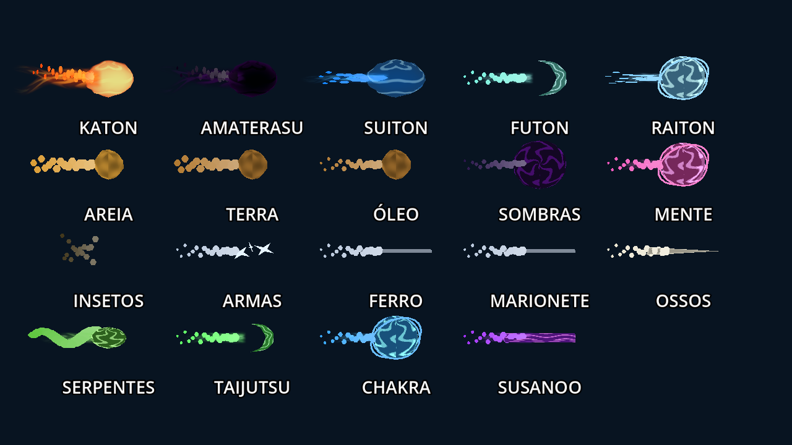
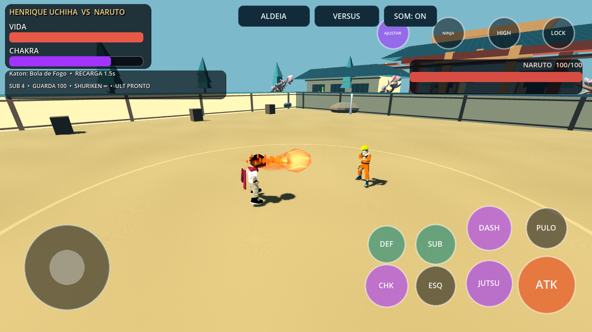
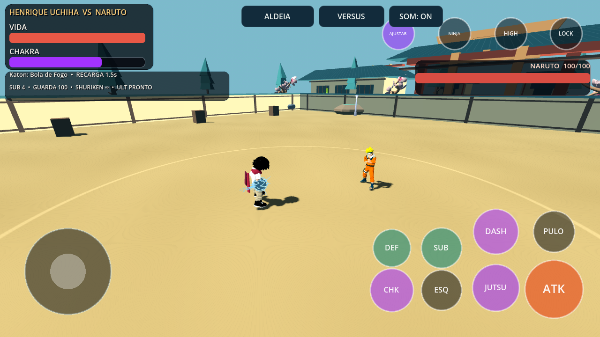
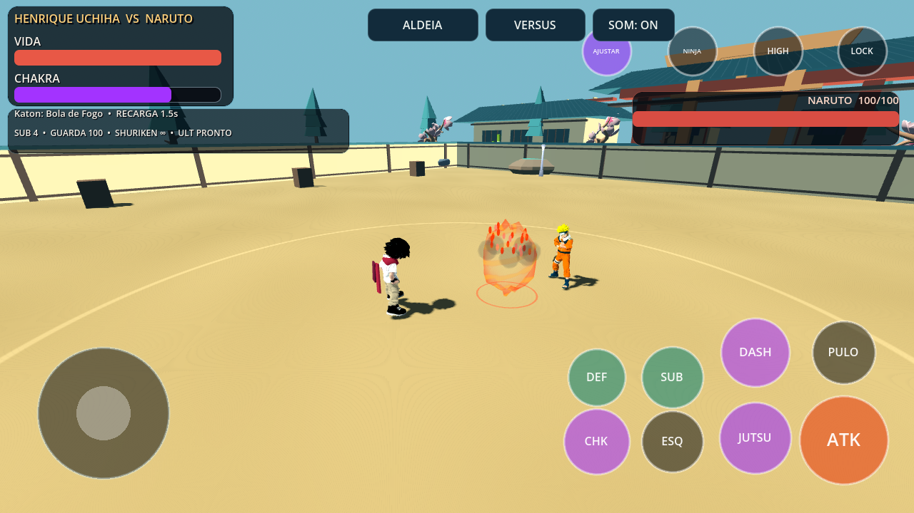

# Shinobi Clash 0.12.0 — apresentação dos jutsus

Esta etapa refina a base visual das 19 famílias usadas pelos kits existentes,
os impactos, o enquadramento e a leitura da luta. Storm 4 é uma referência de
apresentação; esta versão ainda usa efeitos procedurais próprios para mobile,
e não corresponde ao acabamento de produção desse jogo.

## Mudanças

- Fogo/chamas negras/água usam uma superfície translúcida com borda suave,
  cores internas distintas e rastros deformados. Fogo quente e água deixam de
  usar o núcleo opaco de antes. Marcas granulares foram suavizadas para evitar
  padrões subpixel nos materiais de terra/areia/óleo.
- Vento e taijutsu têm um arco modelado. Armas de aço mostram as malhas existentes
  de kunai/shuriken; o Demon Wind do Naruto também reutiliza a shuriken existente.
  Ferro usa um segmento orientado. Ossos, insetos e serpentes preservam suas
  famílias, com proporções distintas nas instâncias do rastro.
- A identificação da técnica chega à visualização no menu e no combate.
  Onda Katon mantém a forma larga; técnicas de fogo/água com “dragon” no ID têm
  núcleo alongado e rastro sinuoso. Não são novos dragões com skeleton.
- Corrigido um defeito de escala: atribuir `basis` para orientar a água e o fogo
  restaurava a escala do núcleo para 1. Agora a orientação preserva o raio.
- Chidori/Raikiri têm forks mais curtos e distribuição irregular, limitados por
  qualidade. Rasengan recebe linhas internas e camada externa ajustadas.
  Amaterasu persistente usa pontas de chama em vez dos volumes arredondados.
- Impactos têm expansão, anel de pressão, fragmentos orientados e fumaça suave;
  variam por família/duração. Projéteis, golpes especiais, supremo em equipe e
  armadilhas usam o pool novo. Dano, colisão, startup, guarda e recargas preservados.
- Jutsus próximos com alvo travado têm preparação enquadrada por até 0,42 s;
  Rasengan mantém sua janela de até 0,62 s. Cancelamento devolve a câmera.
- HUD normal mostra técnica/prontidão/recarga e recursos úteis; nomes internos
  de atores e estados ficam fora dela. `--debug-hud` preserva a inspeção técnica.
  Painel solo de estados tem altura reduzida e fica oculto quando vazio;
  corrida na parede só aparece durante a situação de chefe que permite usá-la.
- Luz, exposição e emissão do chão foram reduzidas para evitar amarelo excessivo.
  A direção compartilhada continua nas arenas, exploração e seleção.

## Limites de renderização

| Recurso | LOW | MED | HIGH |
| --- | --- | --- | --- |
| Impactos ativos | 2 | 4 | 6 |
| Fragmentos por impacto | 8 | 16 | 24 |
| Puffs de fumaça por impacto | 2 | 4 | 6 |
| Camadas de rastro | 1 | 2 | 2 |
| Segmentos elétricos da mão | 8 | 12 | 16 |

Seis impactos ficam pré-alocados; chamadas repetidas reciclam slots. Não há
criação de nós por quadro, novas luzes dinâmicas, física adicional, dependência
de glow ou alterações nos sistemas de dano. LOW mantém formas e cores essenciais.
Os limites não substituem medição em aparelho Android.

## Validação

Godot 4.7.2: 42 contratos de regressão e 21 testes Python. O novo contrato
`jutsu_finish_contract.gd` tem 203 verificações: kits do elenco sem alteração
nos parâmetros, orientação/escala, geometria reutilizada, qualidade, expiração,
limites de pool, interrupção de câmera e HUD. Contratos de jutsus/apresentação
renderizam também em OpenGL Compatibility/Mesa.

O conteúdo foi extraído do APK e executado fora do checkout: contrato novo,
contrato dos jutsus e contrato legado do pacote passaram; os dois primeiros
com renderização OpenGL. APK debug ARM64, Android 7+, versionCode 13,
assinatura v2/v3, alinhamento 16 KB e mesma chave debug dos APKs locais anteriores.

Arquivo: `shinobi-clash-0.12.0-debug.apk`.
SHA-256: `d542b2c5d82667baf32ffa61f43b1c4ffade3799b1b4c9eef4a584bf89e982eb`.

## Capturas de inspeção

Galeria diagnóstica das famílias; as outras imagens são do combate real com
câmera/timeline controladas. Não representam um benchmark de Android.

## O que continua pendente

Modelos e animações dos 26 personagens foram preservados. As representações
simplificadas de marionetes, serpentes, dragões e jutsus complexos ainda precisam
de modelos/coreografias específicos; não foram substituídas por assets do Storm.
Não há novos rigs faciais, dublagem ou cinematográficas completas nesta etapa.
Teste físico, desempenho Android e diagnóstico do fechamento relatado no aparelho
continuam pendentes. Sistemas de equipe, história, exploração e saves existentes
continuam disponíveis; multiplayer permanece uma etapa separada.
