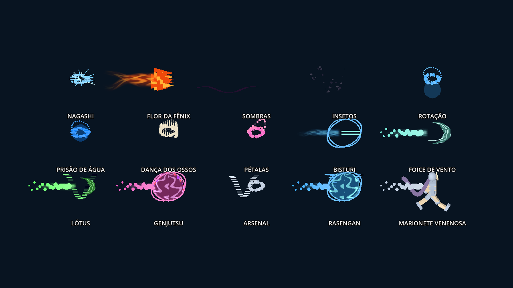

# Apresentação das técnicas — 0.14.0

Continuação de aa25812. `HENRIQUE_INTEGRATION.md` foi lido antes das alterações. Os 26 lutadores, modelos prontos, clips, balanceamento, estados elementais e progresso foram preservados.

## Alterações

`jutsu_signature.gd` acrescenta uma camada visual reutilizável às técnicas e aos impactos. Há seleção explícita para 35 IDs de técnica; os demais usam a família elemental ou identificação de Rasengan. Não são 35 novos jutsus nem 35 animações de lutador novas.

- Nagashi: segmentos elétricos radiais, com vida independente da janela de dano.
- Flor da Fênix: cinco grupos visuais de chamas. Continua um projétil com o mesmo volume de colisão; os grupos não acrescentam cinco fontes de dano.
- Katon amplo, Amaterasu e Genjutsu: acentos de direção, chamas escuras e pulsos de ilusão.
- Sombras: caminho estreito/agulhas no chão, incluindo orientação e escala durante preparação; removida a esfera genérica.
- Insetos: silhueta original com corpo, asas e seis patas em MultiMesh, oscilação e formação de enxame/prisão; não são spheres pintadas de preto.
- Rotação e Proteção dos Oito Trigramas: domo e órbitas hemisféricas. Prisão de Água recebe envoltório translúcido e gotas.
- Dança dos Ossos: campo de espinhos radiais. Clemátide recebe alinhamento de lanças.
- Flores de chakra e impacto da Sakura: pétalas com rotação própria.
- Kabuto: lâminas de bisturi de chakra. Hinata/Neji: traços de palma; essas técnicas deixam de exibir o Rasengan genérico. Naruto/Jiraiya conservam a esfera e ganham acentos de espiral na mão.
- Kiba/Lótus: trilhas helicoidais. Temari: arco de foice. Impactos de terra recebem fissuras visuais; areia envolve/afunda sua formação.
- Marionete venenosa: acentos violeta. Arsenal/Demon Wind: rastros metálicos. A armadilha de Sakura usa a malha de kunai existente, recentrada corretamente nos apoios após rotação.
- Impactos elementais do pool compartilham os acentos de família. Seu ciclo de limpeza mantém o orçamento fixo.
- Corrigido o clarão na origem da arena entre iniciar o jutsu e posicionar o efeito na mão. Ataques de chakra agora posicionam corretamente sua apresentação junto ao hitbox.

Dragões, serpentes, marionetes, mão de areia e tubarão articulados da 0.13 continuam. Clones, Naruto Barrage e armadilha mantêm os controladores próprios; não foram convertidos em efeitos elementais genéricos. Supremo, suporte e efeitos de status continuam com seus contratos anteriores.

## Recursos e limites

Dois nós de geometria por camada: um MultiMesh de até 24 instâncias e um envoltório reutilizável. Qualidade LOW/MED/HIGH: 8/16/24 instâncias; meshes/material são criados na inicialização, nunca durante animação por quadro. Impacts permanecem no pool de seis, com 2/4/6 ativos conforme qualidade. Nenhuma luz dinâmica foi adicionada.

É uma apresentação procedural estilizada. A geometria decorativa não aplica dano, não aumenta alcance, não muda custo/cooldown e não reproduz todas as coreografias do Storm 4. Desempenho no celular não foi medido.

Galeria renderizada no Godot 4.7.2/OpenGL Compatibility/Mesa com timeline controlada; não é captura de aparelho Android nem comparação de desempenho.

## Validação

- 44 contratos GDScript passaram; os testes alterados foram repetidos após os últimos ajustes de armadilha/Demon Wind.
- 21 testes Python passaram, incluindo integridade dos assets/modelos.
- `jutsu_signature_contract.gd`: 3.446 verificações em headless e 3.447 em OpenGL; 60 técnicas, 35 seleções explícitas. Verifica orçamento, transformações finitas, reutilização, vida de áreas, posicionamento da sombra em escala, preservação do tuning e os casos reais de Kabuto/Demon Wind.
- O servidor de renderização dummy não conserva transforms do MultiMesh: o posicionamento real da sombra é verificado em OpenGL, sem simular um resultado equivalente em headless.
- A armadilha foi validada com a malha real de kunai e centros após rotação, além dos contratos anteriores de gatilho e dano.
- APK extraído e executado fora do checkout: assinaturas de técnica em OpenGL, armadilhas/jutsus e recursos do export.
- Novo contrato incluído nos workflows Godot e Android, inclusive OpenGL.

## Android

APK debug ARM64, Android 7+, versionCode 15, `0.14.0-technique-signatures`. Mesma chave debug local das versões anteriores; assinatura v2/v3 e alinhamento de 16 KB verificados.

SHA-256: `d61791baa4bc0cf0281603d2a8531158671d6d74cf73ba41102ddc55520ca80a`.

Teste físico permanece pendente, inclusive a reprodução do fechamento relatado pelo usuário.
