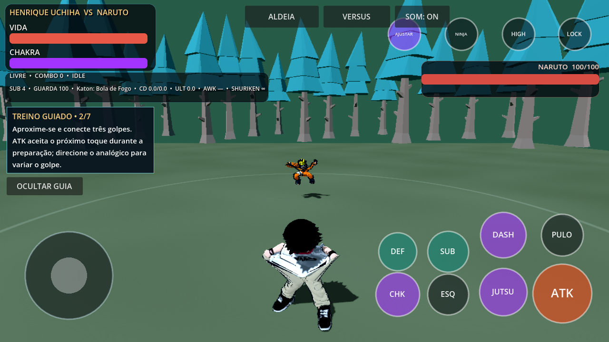
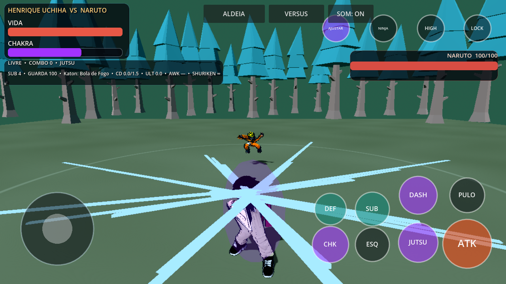

# Shinobi Clash 0.4.1 — combate e treino

Continuação da 0.4.0; os 26 lutadores, assets, saves e sistemas existentes são
preservados. Esta etapa não acrescenta mocap nem altera pesos/geometry do Henrique.

## Mudanças jogáveis

- Próximo toque de ATK pode entrar durante startup. Há no máximo um próximo
  golpe em fila; interrupção/cancelamento limpa a fila.
- Henrique usa variantes direcionais nos três primeiros ataques: esquerda,
  direita, alta (analógico à frente), baixa (analógico para trás); no ar,
  esquerda seleciona versão espelhada. A direção é capturada ao tocar ATK.
  Sem direção, os clips anteriores permanecem. Finalizadores continuam próprios.
- Hitbox, osso de contato e timing usam o manifesto do clip selecionado. Não há
  alteração global dos AttackDefinition compartilhados nem bônus de dano novo.
- Grafo de animação permanece abaixo de 2500 transições; estados da galeria
  continuam disponíveis e personagens mantêm playback independente.
- Nagashi exibe arcos elétricos largos em um MultiMesh prealocado. Não é uma
  simulação física de eletricidade nem um novo sistema de partículas.
- Armadura/perfeito suavizam escala; botão touch muda de AWK para FORMA durante
  a transformação ativa do Henrique.
- Modo Treinamento: sete objetivos guiados, ocultar/mostrar/recomeçar. O botão
  PREPARAR DESPERTAR aparece na última tarefa e ajusta vida/chakra/cooldown
  somente no treino. O guia não grava conquistas nem modifica campanha.

## Validação

Godot 4.7.2.stable.official.ed1daf0bf, Compatibility:

- 32 contratos GDScript passaram, incluindo combate/input, guia, modos, elenco,
  Henrique, CPU, câmera, mundo e campanha.
- 17 testes Python, registro de assets e git diff --check passaram.
- Novo contrato testa fila durante startup, direção congelada, ausência de
  mutação do moveset, clip realmente tocado, timing de impacto, cancelamento,
  limite do grafo, pulso elétrico e preparo de despertar restrito ao objetivo.
- Conteúdo extraído do APK passou no contrato de combate/input fora do checkout.
- APK debug ARM64, Android 7/API24+, pacote org.shinobi.narutorpg3d,
  versionCode 5, versionName 0.4.1-shinobi-evolution.
- SHA256: 29d5fac45c0b638d7a1628ebf0b5438741b13b5bfa7f2a984bdf61d2bb216a70.
- ZIP íntegro, assinatura v2/v3 e alinhamento de páginas 16 KB passaram.
- Capturas em Mesa llvmpipe; sem instalação/teste em aparelho físico.

## Roteiro no Android

1. Confirme 0.4.1 no menu; escolha Henrique, Naruto, Floresta e Treinamento.
2. Siga o guia; conecte o próximo toque antes do primeiro impacto e confira
   que sai apenas o golpe seguinte. Direcione o analógico ao tocar para variar.
3. Interrompa com SUB/esquiva: nenhum golpe enfileirado deve surgir depois.
4. Em NINJA selecione Nagashi; confira o pulso, gasto de chakra e cooldown.
5. Na última tarefa prepare e use AWK; ativo, FORMA alterna Susanoo.
6. Termine o guia; reinicie/oculte e volte à seleção. Campanha permanece separada.
7. Registre aparelho/API, multitouch, pause/resume, Bluetooth e desempenho real.

## CI

O CI 0.4.0 executava o contrato visual com sucesso mas exigia o texto literal
`CONTRACT: PASS`; sua mensagem era `VISIBLE EVOLUTION: PASS`. Agora os contratos
visual e input usam o marcador padronizado, mantendo a rejeição de erros.
