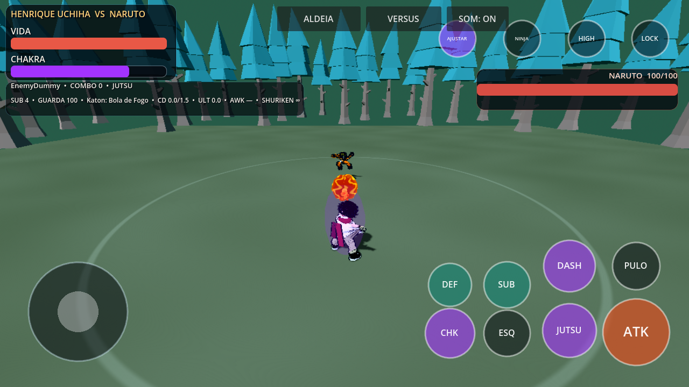
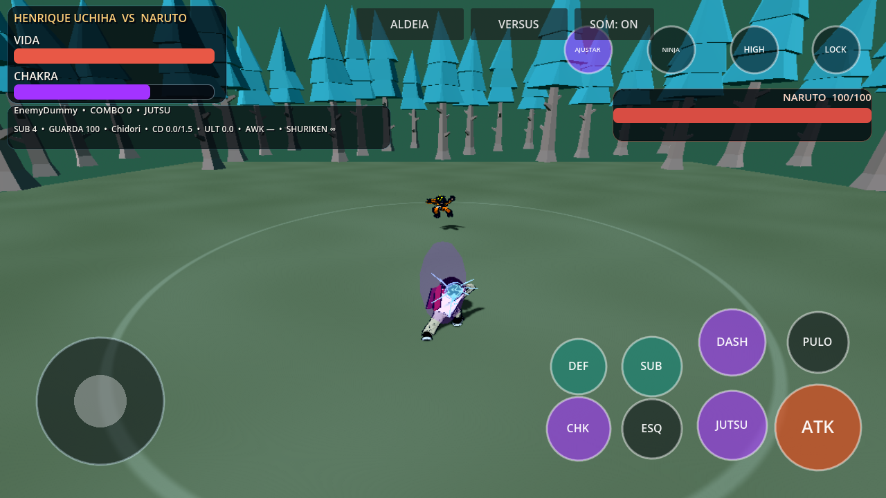
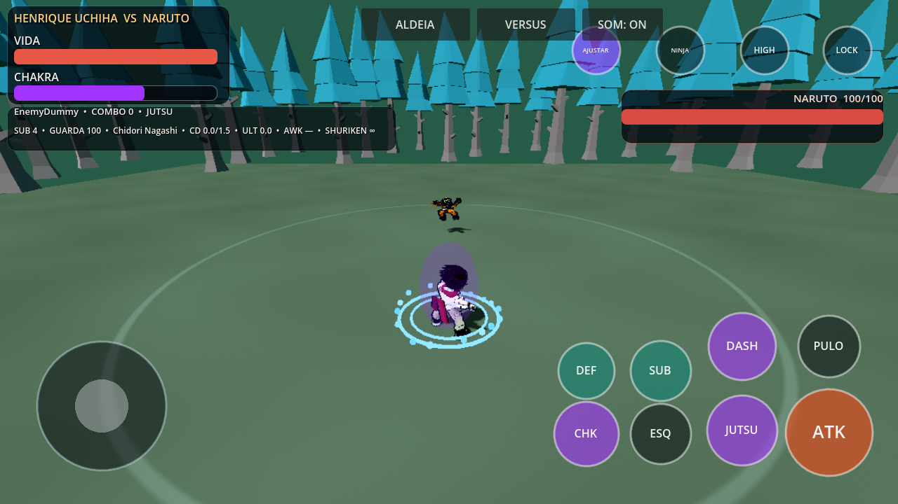
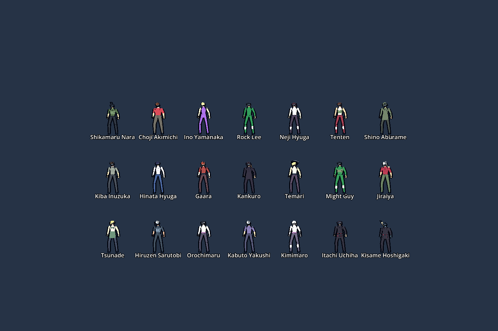
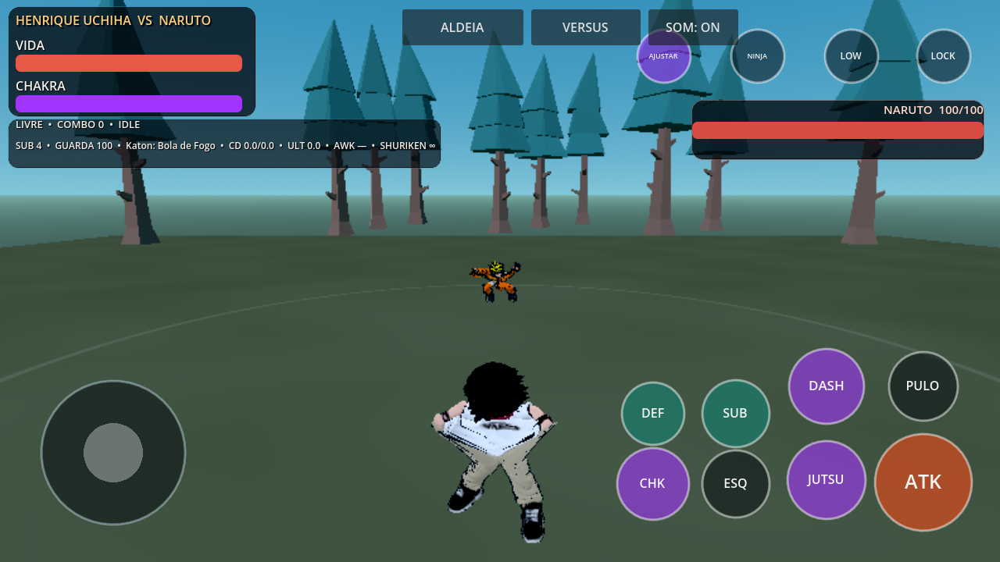
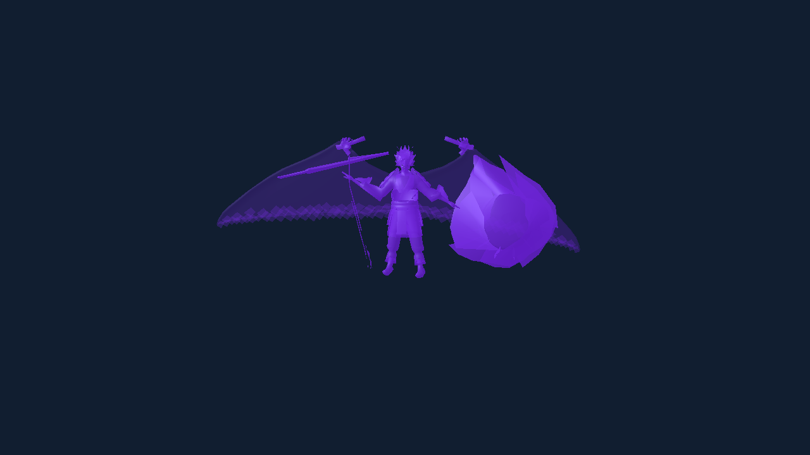
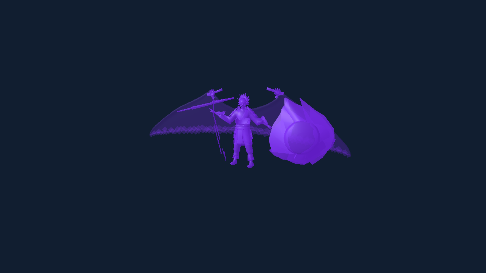

# Shinobi Clash — evolução do projeto existente

## Jutsus elementais — 0.6.0

Chidori/Raikiri agora usam segmentos com escala no eixo local correto: raios curtos ao redor da mão, com núcleo elétrico. A escala e o relógio são reiniciados entre jutsus. Nagashi usa um pulso circular junto ao chão, com vida visual de 0,38 s independente da janela de dano; interrupções limpam imediatamente o efeito.

Projéteis de fogo, água, vento, chakra, chamas negras, mente, areia, eletricidade e Susanoo passam a usar superfície procedural animada e rastro orientado pelo movimento. A onda Katon tem silhueta larga; Amaterasu tem chamas negras animadas também no alvo. Preparação cresce na mão e desaparece ao lançar. Colisões com lutador/parede geram impacto elemental pelo pool existente. Três SFX originais foram sintetizados, mantendo oito vozes de áudio. Com alvo travado, o lançamento já aponta para ele; sem trava, mantém a direção manual. Custos, dano, cooldowns, defesa, substituição, status e personagens continuam pelos contratos existentes.

Efeitos novos usam meshes reutilizados: 6/10/16 motes por instância em LOW/MED/HIGH, sem criar nós por quadro, sem novas luzes dinâmicas. São efeitos procedurais estilizados; não há cinematográficas ou dublagem nova nesta etapa.





Capturas de apresentação feitas no Godot 4.7.2/OpenGL Compatibility/Mesa, com câmera fixa de inspeção e timeline pausada; não são benchmark de Android. APK debug ARM64 0.6.0, versionCode 7, Android 7+. Assinatura v2/v3, alinhamento de 16 KB e conteúdo extraído do APK foram verificados fora do checkout, inclusive renderização do contrato dos jutsus. Teste em aparelho físico pendente.


## Modelos do elenco — 0.5.0

Os 21 personagens que usavam o rig genérico agora têm GLBs próprios com proporções humanas estilizadas, roupa, cabelo, rosto, acessórios skinados e dedos articulados. Cada modelo possui 65 ossos e usa a biblioteca de 127 clips existente. São aproximações originais estilizadas, sem rig facial; acabamento de produção ainda pendente. Naruto, Sasuke, Sakura, Kakashi e Henrique foram preservados byte a byte; fingerprints registrados em `assets/characters/final/roster_manifest.json`. Kits, índices do elenco e sistemas existentes preservados. O fallback permanece disponível se um modelo estiver ausente ou incompatível.



APK debug ARM64 `0.5.0-roster-models`, Android 7+, validação física pendente.


Escopo consolidado do pedido completo, sem criar outro jogo. Base: `main` em
`e779639`, Godot **4.7.2**. A integração original do Henrique foi lida antes das
alterações; continuam os 26 personagens, os modelos existentes, o combate
compartilhado, as regiões, o inventário e o save versão 1.

## Continuação 0.4.1

Combos direcionais, fila de ataque durante startup, pulso elétrico do Nagashi,
transição de escala e treino guiado. Evidências e roteiro em
[SHINOBI_041_VALIDATION.md](SHINOBI_041_VALIDATION.md).

## Atualização visível 0.4.0

- Sete arenas na seleção; cinco novas cenografias originais. Chão e iluminação
  próprios, floresta com assets CC0, vale com rochas/cachoeira/monumentos,
  distrito com edifícios, esconderijo com pilares e ruínas com escombros.
  A física do ringue original permanece; água e escombros são apresentação.
- Quatro formas do Susanoo: parcial e esquelética construídas em runtime;
  armadura e perfeito usam skin de 25 ossos. Perfeito aumenta escala e tem
  asas em HIGH. As formas iniciais usam articulação de nós, sem novo skin.
  AWK/6/direcional direito alterna enquanto ativo; 9 também alterna.
  Dano/movimento: parcial 1.10/1.15, esquelético 1.20/1.10,
  armadura 1.35/1.04, perfeito 1.30/1.08. Não há multiplicador defensivo.
- Nagashi: pulso de 3.2 m; Amaterasu: impacto e chamas por até 3 s, sem
  acumulação ilimitada; Genjutsu: hitstun de 1.4 s e distorção temporária da
  visão do jogador; onda Katon: projétil amplo sem tracking.
  Guarda, esquiva/substituição, obstáculos, custos e cooldowns permanecem.
- Roupa original, lenço e colete em OPÇÕES; acessórios presos aos ossos,
  sem substituir a malha enviada. Não inclui rig facial novo.
- Loops instrumentais originais em exploração, combate e chefes; sem dublagem.
- Menu identifica versão 0.4.0; APK versionCode 4, mesmo pacote Android.




## Histórico da entrega 0.3.0

- **127 clips humanos**, incluindo as 100 adaptações CC0 da etapa anterior.
  Os 27 originais continuam preservados. São variantes de fontes existentes,
  não 100 novas gravações de mocap.
- **Susanoo com skin real e 25 ossos**: tronco, cabeça, pernas, dois pares de
  braços, mãos e asas. A geometria/texturas de origem permanecem intactas.
  Cinco clips de keyframes próprios: idle, walk, slash, guard e summon.
  Golpe amostrado no impacto real da animação do lutador, recuperação completa,
  pausa de impacto, defesa e invocação. A espada original acompanha a mão;
  a lâmina separada da versão anterior foi removida do modelo externo.
  Armadura com iluminação e maior opacidade, asas translúcidas somente em HIGH.
- **Defesa precisa**: entrar na guarda abre 0,12 s para aparar ataques de dano
  inferior a 40; um acerto aparado abre 0,55 s para um ataque com dano ×1,4 e
  knockback ×1,3. O bônus é consumido uma vez; a guarda normal permanece.
- **Agarrão/arremesso**: G no teclado ou defesa + ataque no touch/controle.
  Exige chão, distância inicial de 1,65 m e preparação sem outra ação.
  O impacto revalida distância, paredes e invulnerabilidade; escapar durante
  a preparação evita o golpe. Supera a guarda, aplica dano/lançamento pelo
  contrato existente e tem cooldown de 1,5 s. Usa a animação de alcance atual;
  não é uma captura sincronizada de duas pessoas.
- **Quatro dificuldades de CPU**: Treino, Normal, Difícil e Jounin.
  Mudam frequência de decisões, agressividade, defesa, esquiva e uso de jutsu.
  Treino desliga respostas a projéteis e substituição reativa. Perfis são
  duplicados, sem alterar os kits globais nem aumentar dano/vida por dificuldade.
- **Controle Android/Bluetooth**: eixos analógicos, câmera no stick direito,
  ataque/salto/jutsu/dash, guarda/chakra, substituição, esquiva, ultimate e
  despertar. Também movimento, câmera, interação e mapa na exploração.
  A conexão depende do reconhecimento do controle pelo Android/Godot; não
  houve teste com hardware Bluetooth nesta sessão.
- **Layout touch editável**: AJUSTAR pausa a luta; arraste analógico ou os oito
  botões principais. SALVAR retoma e registra posições normalizadas; RESET
  restaura o padrão. Qualidade, lock e opções avançadas ficam no topo.
  Preferências de layout/dificuldade/volume têm arquivo próprio, separado do save.
- **Modos na seleção**: batalha livre, treinamento com dummy que reinicia após
  KO, torneio solo de três duelos eliminatórios, sobrevivência com adversários
  sucessivos e vida restante +15 entre vitórias, e três desafios de chefes com
  fase 2. O torneio não simula uma chave completa de batalhas entre outras CPUs.
- **História própria**: HISTÓRIA HENRIQUE abre “A Marca e a Escolha”, seis
  capítulos autorais nas regiões existentes. A primeira decisão seleciona Naruto
  ou Sasuke como rival. Escolha, capítulos e recompensas persistem; a campanha
  anterior mantém seus próprios índices e continua em EXPLORAR ALDEIA.
  As cenas são diálogos com pausa e apresentações de batalha, sem dublagem.
- **APK debug** `0.3.0-shinobi-evolution`, versionCode 3, ARM64,
  Android 7.0/API 24 ou superior. As verificações de pacote são descritas abaixo.



## Como testar

1. Abra a seleção, escolha Henrique e Naruto; em OPÇÕES escolha a dificuldade.
2. Selecione o modo e toque LUTAR. No treino o alvo fica parado e reinicia após KO.
3. Para aparar, inicie a defesa imediatamente antes de um golpe e ataque em seguida.
4. Perto de um alvo, mantenha defesa e pressione ataque para tentar arremessar.
5. Use AJUSTAR para mover os controles; SALVAR retoma a luta.
6. Para despertar Susanoo, mantenha as condições existentes: HP ≤50%, chakra
   cheio, no chão e sem outra ação. Verifique marcha, guarda, golpe e recuperação.
7. Na seleção, HISTÓRIA HENRIQUE inicia o arco separado. Converse no ponto de
   missão; escolha um rival; siga os capítulos por floresta, rio e vale.
8. Na sobrevivência, termine um duelo e use PRÓXIMO ADVERSÁRIO; a vida não
   volta automaticamente ao máximo. REVANCHE reinicia a série.

Controle: X ataque, A salto, Y jutsu/interação, B dash; LB defesa, RB chakra;
LB + X agarrão; direcional baixo substituição, esquerda esquiva, cima ultimate,
direita despertar; clique do stick direito lock/mapa. Teclado e touch existentes
continuam funcionando.

## Plano completo e critérios de saída

A tabela registra o restante do pedido. Recursos nesta coluna são trabalho
pendente, não recursos prometidos como presentes no APK.

| Prioridade | Área | Base/entrega atual | Trabalho e critério para concluir |
|---|---|---|---|
| 1 | Combate | Combos, perseguição aérea, dash, substituição, esquiva, guarda/quebra, reações, impacto, clones do Naruto, IA; agora aparo e arremesso | Polir transições/cancelamentos, chutes e combo contra parede/chão em todos os lutadores; duas pessoas sincronizadas nos agarrões; finalizações específicas; partidas completas sem golpes atravessando obstáculos ou estados presos |
| 2 | Henrique | Modelo fornecido, 65 ossos, pesos refinados, clips retargetados, lenço/colete acessórios | Rig facial, expressões, roupas inteiramente modeladas e skinadas, revisão manual de mãos/cotovelos e locomação; poses válidas de todos os clips e identidade visual aprovada |
| 3 | Poderes/Susanoo | Sete jutsus, awakening/ultimate, quatro formas com diferentes estruturas | Sharingan/Mangekyou visíveis nos olhos; substituir as formas procedurais por skin própria e polir efeitos/transições; custos e recuperação avaliados em partidas reais |
| 4 | Efeitos e apresentação | Partículas/impactos, câmera, rastros e materiais existentes; armadura iluminada | Expandir fumaça/faíscas/destruição visual e cinema específico por golpe; leitura clara e orçamento de efeitos medido em aparelho |
| 5 | Android/interface | Touch editável, analógico, controle e opções; APK | Testar toque simultâneo, reconexão Bluetooth, diferentes proporções, pause/resume; ajuste de tamanho/opacidade e remapeamento; estabilidade e desempenho registrados em aparelhos reais |
| 6 | Mundo e arenas | Konoha, floresta, rio e vale exploráveis; sete arenas de combate | Polir cenografia, adicionar água/destruição interativas e validar câmera/colisões das sete arenas; NPCs/eventos/lojas e missões adicionais sem bloquear navegação |
| 7 | História/modos | Arco Henrique de seis capítulos e escolha; cinco modos | Mais decisões com consequências posteriores, rivais e cutscenes encenadas; chave completa de torneio, desafios específicos, ranking persistente e personalização |
| 8 | Som | SFX, volume e três loops instrumentais próprios | Expandir as trilhas e gravar a voz do Henrique e gritos, poses/introduções/vitórias por lutador; arquivos de áudio reais e mixagem revisada |
| 9 | Sistemas | Save/carga, seleção, HUD, XP/skills, inventário, desbloqueios e progressão existentes | Conquistas, tutorial guiado, recuperação/backup do save, equipamentos e customização; testes de migração e de fluxo completo no Android |
| Separada | Multiplayer | Fora desta etapa, conforme pedido | Definir transporte/servidor, sincronização, matchmaking e testes de rede antes de anunciar modo online |

Modelagem de roupas/face e gravação de voz exigem produção de assets próprios;
os screenshots enviados servem como referências. Eles não contêm esses assets.
A pele nova do Susanoo é um rig ajustado ao modelo disponível, não o rig original
comercial das referências. As quatro formas estão presentes na 0.4.0; as duas primeiras são procedurais.

## Reprodução e validação

```sh
python tools/rig_susanoo.py
python -m unittest discover -s tests -p 'test_*.py'
/path/Godot_v4.7.2-stable_linux.x86_64 --headless --path . --editor --import
/path/Godot_v4.7.2-stable_linux.x86_64 --headless --path . --script res://tests/evolution_contract.gd
/path/Godot_v4.7.2-stable_linux.x86_64 --headless --path . --script res://tests/arcade_modes_contract.gd
/path/Godot_v4.7.2-stable_linux.x86_64 --headless --path . --script res://tests/henrique_campaign_contract.gd
```

O gerador usa numpy/scipy/Pillow pelas utilidades GLB existentes. Mantém os
bytes da geometria/texturas e acrescenta pesos, skeleton e animações. Manifesto
e registro guardam fingerprint, atribuição e status atuais; se o gerador mudar,
atualize o fingerprint do derivado no registro antes de exportar.

Novos contratos verificam ossos e skin efetivos, articulação no impacto, freeze
com delta zero, recuperação, perfis independentes, controle analógico, defesa,
contra-ataque, arremesso/escape, pause/layout, sequências dos modos e escolha/save.
Os contratos anteriores continuam exercitando elenco, Naruto, Henrique, jutsus,
CPU, câmera, regiões, campanha e limpeza de pools. A limpeza agora usa o número
de autoloads inicial como referência, mantendo a detecção de entidades vazadas.

Verificação Android: export com Godot/templates 4.7.2, assinatura `apksigner`,
alinhamento `zipalign -P 16`, integridade ZIP e carregamento do payload extraído
fora do checkout. A CI roda os novos contratos e exporta APK + SHA-256.
**Não houve execução em celular físico, emulador Android ou controle Bluetooth.**
A captura OpenGL usa llvmpipe e não mede desempenho de celular.

### Resultado da validação desta entrega

- 30 contratos GDScript da base e desta etapa passaram; os contratos afetados
  foram repetidos após os últimos ajustes. 17 testes Python passaram.
- OpenGL Compatibility renderizou a seleção, Henrique transformado e três
  fases do Susanoo; os materiais e o contrato de combate passaram.
- O payload do APK foi extraído e carregado em `/workspace/toolchain`, fora do
  checkout: elenco, mundo, jutsus, skin de 25 ossos e nova campanha passaram.
  Os três novos contratos também passaram sobre esses mesmos bytes exportados.
- Assinatura v2/v3, alinhamento de 16 KB, integridade ZIP e registro de assets
  passaram. O teste negativo de publicação continuou excluindo os assets.
- APK local: 60.286.567 bytes, package `org.shinobi.narutorpg3d`, versionCode 3,
  mínimo API 24, target API 36 do template oficial.
  SHA-256 `f79378aefde3b7965cfbac50ad02790a1d0a1e3655410be4bdfd4bdb0391b9f9`.
  A assinatura debug da CI pode produzir outro fingerprint do APK.

### Validação da etapa 0.5.0

32 contratos anteriores passaram; contrato adicional dos 21 modelos passou com
316 verificações de skin, caminhos próprios, mãos, escala e poses animadas.
19 testes Python passaram, incluindo pesos normalizados, fingerprints distintos,
limite de 14 mil triângulos por novo modelo e preservação dos cinco modelos prontos.
Galeria idle/golpe capturada no Godot 4.7.2 com OpenGL Compatibility/Mesa;
não constitui benchmark Android. Conteúdo extraído do APK passou nos contratos
isolados do export e dos 21 modelos, sem acesso ao checkout. Assinatura v2/v3
e alinhamento de 16 KB verificados. APK debug ARM64, versionCode 6;
teste em dispositivo real pendente.

### Validação da etapa 0.6.0

34 contratos GDScript passaram; 19 testes Python passaram. O contrato adicional
verifica endpoints dos raios, orientação/limites dos rastros, orçamentos LOW,
expiração de pulsos, reset de escala/reutilização, preparação, alvo travado,
lançamento e cancelamento (60 verificações). Também passou em OpenGL Compatibility
e no conteúdo extraído do APK, fora do checkout. Modelos prontos preservados pelos
fingerprints existentes. Sem validação física de Android nesta etapa.
