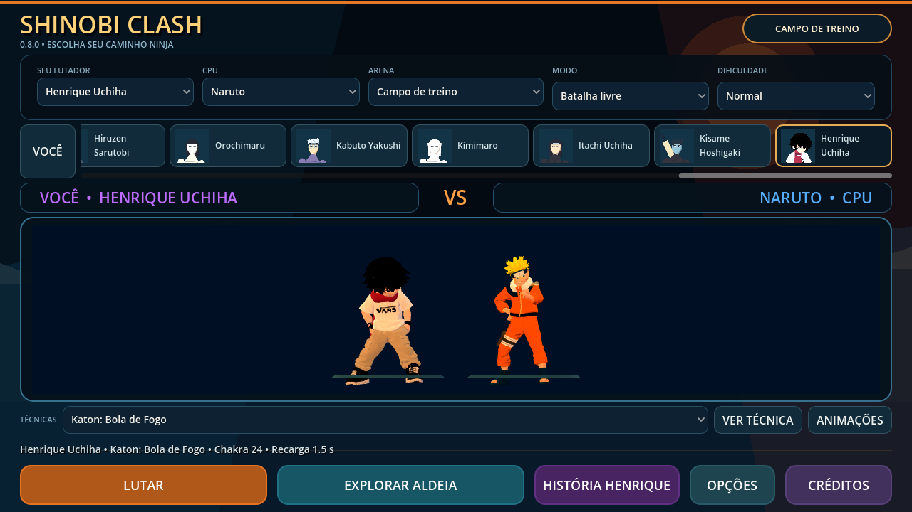
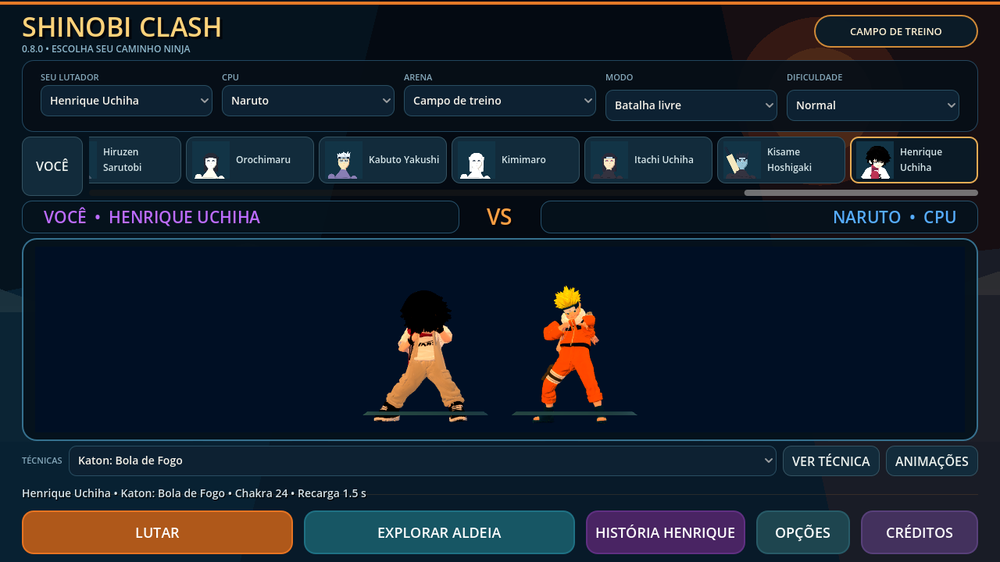
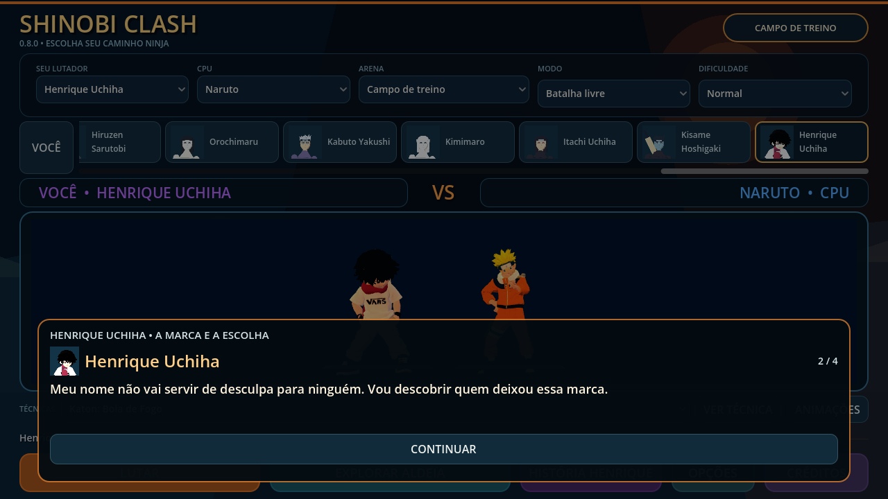

# Henrique e Naruto — correção 0.8.0

A roupa em forma de leque da captura da versão 0.7.0 já existia na malha em repouso. O ajuste offline anterior transformava a geometria de uma pose assimétrica para T-pose usando influências que ligavam partes da camisa às mãos; a deformação ficava gravada nos vértices. Antisserrilhado e animação idle não corrigiam esse problema.

`tools/repair_fighter_skin.py` recupera a geometria anterior por inversão dos blends usados no ajuste e a liga diretamente ao esqueleto encaixado na pose original. Pesos do torso são limitados à coluna; braços usam apenas a cadeia do mesmo lado. Rest, inverse binds e posição de bind dos quadris permanecem coerentes. Os 65 ossos e os 127 clips continuam disponíveis por retarget.

As definições de Henrique e Naruto agora usam `assets/characters/repaired/*_mobile.glb`. Os GLBs anteriores permanecem byte a byte no repositório; os outros 24 personagens não foram remodelados. Índices, UVs, materiais e imagens embutidas da dupla foram preservados. Normais, vértices, pesos e bind foram corrigidos nos derivados. Não há rig facial novo.

| Malha | Maior aresta antes | Maior aresta corrigida |
|---|---:|---:|
| Naruto | 83,05 cm | 9,06 cm |
| Henrique | 70,90 cm | 19,51 cm |

Medida na geometria em repouso, antes da normalização para a altura do jogo. É evidência da remoção dos triângulos esticados, não uma medida de fidelidade de todas as poses. Os contratos existentes avaliam as skins dos dois personagens em três fases dos 127 clips, verificando movimento, pesos e limites.




## Combate, jutsus, menus e aldeia

- Dificuldade disponível na seleção; custo de chakra e recarga da técnica aparecem antes da luta. A prévia usa a duração do clip escolhido.
- Efeitos de mão crescem durante preparação; a dupla e seus hitboxes passam a acompanhar o rig corrigido. Custos, dano e cooldowns dos kits foram preservados.
- Difícil/Jounin podem pressionar uma guarda visível com o golpe forte existente, com startup normal. Probabilidade de reação a projéteis, substituição e tempo de resposta dependem da dificuldade. Não foram adicionados multiplicadores de vida/dano à dificuldade.
- Diálogos da história têm retrato do interlocutor conhecido, contador de falas e padding. NPCs de conversa na aldeia olham para o jogador e mostram orientação conforme a missão atual. Conversas pausam/restauram o mundo; lojas, missões e save versão 1 permanecem nos fluxos existentes.



## Reprodução e validação

```sh
git show e779639:assets/characters/henrique/henrique_mobile_rigged.glb > /tmp/henrique-baseline.glb
python3 tools/repair_fighter_skin.py --henrique-baseline /tmp/henrique-baseline.glb
```

Não exige os uploads originais privados nem gltfpack; usa numpy/scipy e os arquivos já derivados. Modelos/fontes anteriores não são sobrescritos. As classificações de proveniência existentes permanecem para os derivados e retratos.

Godot 4.7.2: os 35 contratos anteriores e o novo contrato de integração passaram; 21 testes Python passaram. O contrato novo tem 47 verificações de seleção, rig, dificuldade, startup e diálogo de NPC. Os modelos continuam avaliados no combate, clones, CPU, seleção e exploração pelos contratos existentes. Os testes novos verificam índices, UVs, imagens/materiais, normalização dos pesos, coerência de binds e redução das arestas esticadas.

APK debug ARM64 0.8.0, versionCode 9, Android 7+. Capturas foram feitas em OpenGL Compatibility/Mesa, sem representar benchmark de celular. Instalação, multitouch, controle Bluetooth e desempenho em aparelho físico permanecem pendentes.

Assinatura v2/v3 e alinhamento de 16 KB aprovados. SHA-256 do APK local: `8f02c94fcf11e922b2ed1c8e981a874ba7c7bdbfdce7eb4d503fa82a6157354e`.

Conteúdo extraído do APK, fora do checkout: contrato do payload aprovado; integração (47 checks) e jutsus (60 checks) aprovados em OpenGL Compatibility.
