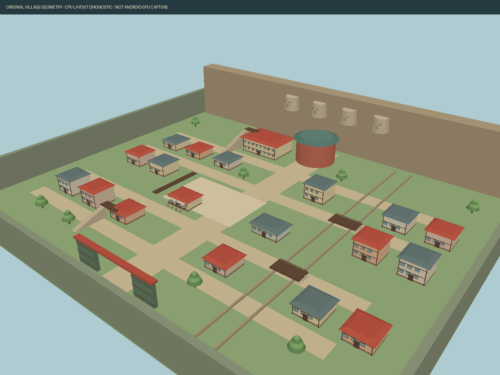

# Mundo Shinobi — referência Storm 1

Pesquisa em 2026-10-03. Direção: Konoha explorável fisicamente com a maior fidelidade prática possível, não uma vila genérica ou menu de missões. O pedido mais recente priorizou a aldeia: um primeiro trecho autoral jogável foi implementado, preservando a batalha existente. Ainda não é o mapa completo/medido do Storm 1.

## Confirmado publicamente

A [descrição oficial mobile](https://play.google.com/store/apps/details?id=com.bandainamcoent.ultimateninjastorm) confirma exploração livre de Hidden Leaf Village, missões e minigames no Ultimate Mission Mode. A versão mobile acrescenta autosave, retry, modos casual/manual, assistências e controles de exploração adaptados. Isto sustenta botões touch diretos, sem alterar o alvo principal Storm 1.

A [Narutopedia](https://naruto.fandom.com/wiki/Naruto%3A_Ultimate_Ninja_Storm) descreve a campanha da Parte I até a recuperação de Sasuke: missões Flashback ordenadas e Free Missions D–S, condições bônus e recompensas.

O [guia Ashurii de 2008](https://gamefaqs.gamespot.com/ps3/943434-naruto-ultimate-ninja-storm/faqs/54852) documenta exploração, missões de Konohamaru, desafios de árvores/corrida e lojas. A academia/Iruka usa scrolls para habilidades; a loja de insetos converte coletas em ryo. [Guia des326](https://gamefaqs.gamespot.com/ps3/943434-naruto-ultimate-ninja-storm/faqs/54663) descreve mapa, scrolls secretos após missões e lojas.

## Levantamento ainda necessário

Não há levantamento métrico do mapa nesta sessão. Não inventar ruas, bairros ou afirmar reprodução do layout. Antes da fase de construção, comparar capturas públicas de exploração e mapa: rotas entre academia, Ichiraku, lojas e torre; ruas/becos/pontes, telhados acessíveis, altura dos saltos, paredes/limites, landmarks, NPCs, coletáveis, objetos quebráveis, condições de desbloqueio, entrada/saída de batalha. Registrar timestamps e medidas relativas, com confiança por região. Vídeos localizados não equivalem a quadros assistidos/medidos.

## Estrutura de referência e expansão futura

Exploração com corrida/salto/verticalidade/interação → evento orientado a Resource → transição → combate existente → resultado/recompensa/progresso → retorno à posição segura no mundo. Missões de história, conversa, coleta, entrega, treino e desafio usam dados configuráveis. Saves versionados em user://, com migração e escrita atômica.

Android: setores/chunks, visibility ranges/LOD/instancing, colisões simplificadas, iluminação baked, NPCs e VFX em pools, perfis LOW/MEDIUM/HIGH. Streaming não deve causar hitch perceptível nas rotas de telhado.

## Assets pesquisados

[Kenney Modular Buildings](https://kenney.nl/assets/modular-buildings), CC0, e [KayKit Medieval Hexagon Pack](https://github.com/KayKit-Game-Assets/KayKit-Medieval-Hexagon-Pack-1.0), CC0 com licença no repositório. Podem fornecer bases técnicas/prototipagem; nenhum reproduz a arquitetura exata de Konoha. Não foram importados nem apresentados como mundo final. Fachadas, telhados e landmarks específicos exigem autoria ou assets compatíveis com licença clara. Nenhum rip/dump de Storm foi adquirido.

## Trecho jogável implementado — 2026-10-03

A [VIZ, editora de Naruto](https://www.viz.com/blog/posts/naruto-shippuden-ultimate-ninja-storm-legacy), também descreve Storm 1 com cidade inteira e travessia pelos telhados. Essa estrutura guia o trecho atual. As proporções e posições abaixo são autoria/ajuste do projeto, não medidas do mapa comercial. Não houve extração de arquivos nem análise quadro a quadro de vídeos.

| Área/sistema | Estado atual |
|---|---|
| Terreno | Área de 156 × 132 unidades; avenidas/becos, praça, portão, canal e duas pontes |
| Edificações | 16 casas, academia, ramen, ferramentas, torre cilíndrica e relevos simplificados na falésia; meshes autorais agrupadas por setores |
| Telhados | Eaves inclinados com colisão convexa, terraços, escadas com rampas físicas e passarelas; caminhos precisam de comparação visual final |
| Exploração | Analógico, corrida, salto + um salto aéreo, coyote/buffer, câmera com SpringArm volumétrico e FOV moderado; 27 clips existentes preservados |
| Personagem/NPCs | Rig fornecido preservado e quatro cópias como moradores de teste; nenhum é anunciado como modelo final de Naruto/Iruka/etc. |
| Interações | AÇÃO/E a até 3.6 unidades, com raycast para impedir conversa através de paredes; textos originais |
| Coleta | Percurso autoral de três pergaminhos, coleta por overlap físico após aceitar missão; retorno ao instrutor recompensa 150 ryō uma vez |
| Treino | NPC da praça abre `main.tscn`; KO → resultado → repetir/retornar ao checkpoint; primeira vitória dá 100 ryō |
| Loja | Pacote por 40 ryō, máximo 3; um pacote acrescenta uma bomba e uma food pill ao próximo treino e é consumido |
| Mapa | Vista esquemática derivada das posições reais do trecho; jogador, moradores e pergaminhos; abrir suspende movimento |
| Save | JSON v1 em user://world_save.json; escrita temporária + rename, posição/ryō/coleta/quests/pacotes; formato futuro/corrompido preservado; spawn ocupado retorna ao portão |
| Mobile | LOW/MED/HIGH controlam resolução, sombras, distância dos setores/NPCs e atualização de animação distante; foco perdido libera touches |

Os dois desafios atuais são autorais para validar a ligação mundo/batalha. Não correspondem às 101 missões/campanha completa do jogo de referência. Posições, custos e velocidades são valores próprios. Não há missão de história, wall run, Naruto Cannon, objetos quebráveis, interiores, streaming assíncrono, LOD de substituição ou navegação de multidões ainda. NPCs são estáticos; a CPU de combate continua na implementação anterior.

Imagem diagnóstica de layout, renderizada em CPU a partir dos meshes reais gerados pelo Godot. Não é captura do Storm nem screenshot da GPU Android; personagens/UI não aparecem neste diagnóstico.

Entrada: botão ALDEIA no combate (F10 no PC). O início do projeto permanece no combate previamente testado. A forma salva de retornar ao mundo não cria outro controlador de luta. Aplicativo fechado durante treino retorna ao fluxo inicial; progresso do mundo permanece, mas HP/estado de luta não são persistidos.
