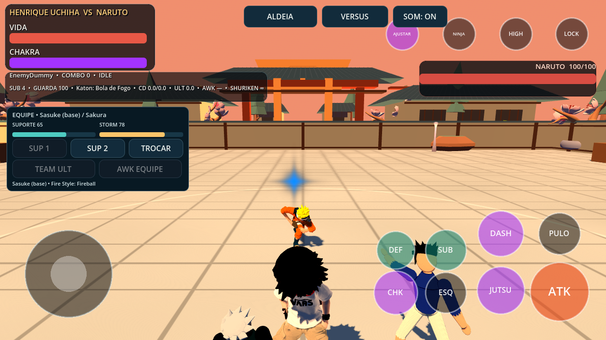
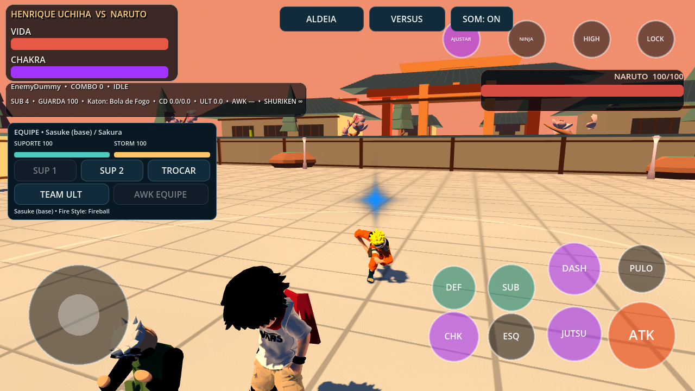
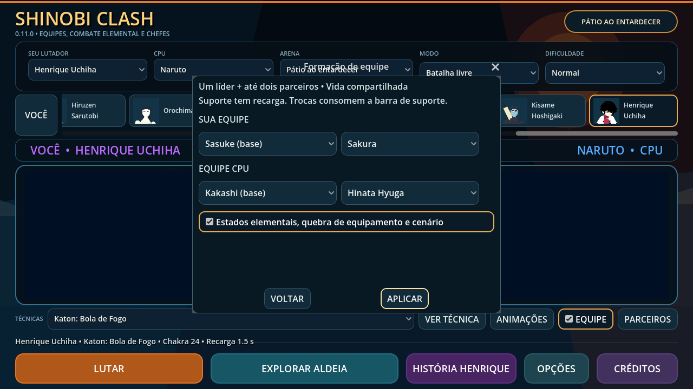

# Shinobi Clash 0.11.0 — equipes e interações

Continuação do projeto existente, com os 26 lutadores, 127 clips, modelos,
campanhas, progresso versão 1 e fluxo de carregamento preservados.

## Jogar

No menu, **EQUIPE** habilita as equipes; **PARCEIROS** configura até dois
parceiros por lado e habilita as regras de interação. Parceiros iguais ao líder
são ignorados ao formar a equipe. **Sem parceiro** permite equipes menores.
As escolhas são lembradas durante a sessão. Desmarcar EQUIPE permite luta solo;
as regras elementais/equipamento/cenário podem ser desativadas separadamente.

Na luta, os botões mostram SUP 1, SUP 2, TROCAR, TEAM ULT e AWK EQUIPE.
Teclado: Z/X, C, V, B, respectivamente. No controle: clique no analógico
esquerdo para suporte 1, Back para suporte 2, Start para trocar; chakra + jutsu
ativa Team Ultimate, chakra + despertar ativa Linked Awakening.
O mapeamento é próprio do projeto; não é o mapeamento do jogo comercial.

## Regras implementadas

| Sistema | Comportamento desta versão |
| --- | --- |
| Equipe | Líder e até dois parceiros, com uma vida compartilhada por lado. |
| Suporte | Modelo e clip do parceiro, técnica de seu kit, preparação, aproximação ou projétil; vulnerável à interrupção. |
| Recarga | Barra compartilhada 100, regeneração 8/s; suporte custa 35 e recarrega em 6 s por membro; interrupção estende a recarga. |
| Troca | Custo 25, intervalo 1,5 s; preserva corpo, câmera, alvo, vida, substituições e ferramentas. Chakra e recargas de habilidade permanecem por membro. |
| Combo em equipe | Troca somente após contato confirmado, dentro da janela de cancelamento do clip; novo líder inicia seu próprio golpe. |
| Storm | Contatos e dano recebido enchem a barra; bônus limitados por contato. Defesa reduz o ganho ofensivo. |
| Supremo conjunto | Storm 100, suporte 50, chakra 65; entrada próxima com caminho livre, líder e até dois parceiros em cena, quatro impactos, câmera; defesa reduz dano e substituição pode interromper. |
| Linked Awakening | Storm 100, suporte 50, chakra ≥80%, vida ≤50%; janela compartilhada de 12 s. Cada líder usa seu despertar ao assumir. Suportes têm aura própria, dano limitado adicional e Henrique mostra Susanoo. |
| Ações automáticas | Strike Back segue lançadores; Cover Fire acompanha ferramentas; Charge Assist repõe chakra durante carga; Charge Guard protege uma quebra de guarda; Dash Cut interrompe dash próximo. Exigem Storm ≥40, suporte e intervalo de 7 s. |
| Estados | Fogo tem dano periódico; óleo o amplifica; água apaga fogo comum e aplica molhado; eletricidade consome molhado para um pulso adicional. Amaterasu mantém chamas negras próprias. Guarda e invulnerabilidade são respeitadas. |
| Resposta | Dano periódico não cancela combos. Substituição abre 0,5 s de contra-ataque para jogador e CPU. |
| Equipamento | Pressão de dano rompe armadura: ataque +8%, dano recebido +6%, marcas ligadas ao skeleton. Golpes defendidos fortes podem romper armas de usuários definidos: ataque −10%. |
| Cenário | Oito objetos com colisão destrutível, seis fragmentos por objeto, 24 marcas recicladas que expiram. Golpes e jutsus podem destruí-los. Vale/ruínas têm punição limitada ao atingir bordas sob knockback. |
| Chefes | Fase 2 existente recebe QTE ATK/DASH/SUB, com limite e resultado; técnica gigante telegráfica de área que pode ser evitada. Itachi usa o Susanoo articulado; outros chefes usam projeções elementais estilizadas. |
| Corrida em parede | Travessia curta e elevada perto da parede, somente na situação de história com chefe em fase 2. Botão na interface. |
| Mob Battle | Novo modo Esquadrão inimigo: três ninjas simultâneos, alvos/HP/rigs independentes, vitória somente após todos os KOs. Suporte continua funcionando após cair o primeiro adversário. |
| Treino | CPU e seus parceiros não atacam; controles de equipe não cobrem o guia existente. |

São regras e coreografias **OUR_APPROXIMATION**, ajustadas ao combate e aos
recursos atuais. Supreme combina técnicas de qualquer formação; não inclui
cinematográficas exclusivas para cada combinação. Despertares de suporte usam
aura simplificada, exceto o Susanoo do Henrique. Armor/Weapon Break têm efeitos
de jogo; não há novas malhas de roupas rasgadas ou armas partidas nesta etapa.
As bordas não implementam Ring Out de KO instantâneo. A técnica gigante não
é uma campanha nova de chefes canônicos. A campanha original do Henrique
continua com seus seis capítulos e escolhas existentes.

## Referências oficiais

- [Manual de Storm 4, páginas de batalha 10, 19 e 20](https://media-center.namcobandaigames.eu/manuals/nsuns4/game/pc/NSUNS4_PC_manual_GB.pdf): equipamento, suporte e ações automáticas.
- [Leader Change — Bandai Namco](https://naruto-game.bngames.net/system/index.html): alternância entre líder e suportes, incluindo durante combos.
- [Supremos combinados e despertar em equipe — Bandai Namco](https://naruto-game.bngames.net/sp/system/system04.html): recursos associados à equipe/Storm.

Referências consultadas em 2026-10-08; não foram extraídos modelos, imagens,
animações ou áudio do jogo comercial. Valores, implementação e história próprios.

## Validação e limites

- Godot 4.7.2, OpenGL Compatibility/Mesa e importação sem erros de script.
- 41 contratos de regressão e 21 testes Python, incluindo fingerprints do elenco.
- Novos contratos: equipe (todo o elenco), estados/equipamento/cenário, chefes e mob.
- Conteúdo extraído do APK executado fora do checkout, incluindo equipe em OpenGL.
- Capturas de inspeção em 1280×720, com timeline/câmera controladas; não são benchmark Android.
- Suportes aparecem por tempo limitado; até dois suportes simultâneos nas chamadas
  comuns, duas presenças adicionais no supremo; cache de animações limitado a quatro.
- Debug ARM64, Android 7+, versionCode 12, assinatura v2/v3 e alinhamento 16 KB.
  Mesma chave debug dos APKs locais anteriores. Teste físico e desempenho pendentes.

APK local: `shinobi-clash-0.11.0-debug.apk`

SHA-256: `b7212a3db5191bc86b3f59c8c51770b1e2c6cae7f0ec7703cdbaa53125c20660`

## Etapas seguintes do plano solicitado

Multiplayer online e versus local entre dois jogadores continuam pendentes;
exigem outra camada de controle/sincronização. Também permanecem para refinamento
malhas de dano por traje/arma, formas completas de todos os suportes, supremos
exclusivos de combinações, chefes gigantes com fases/collision rigs próprios,
cinematográficas completas, dublagem e rig facial. O acabamento de produção
dos personagens continua separado desta integração de mecânicas.
